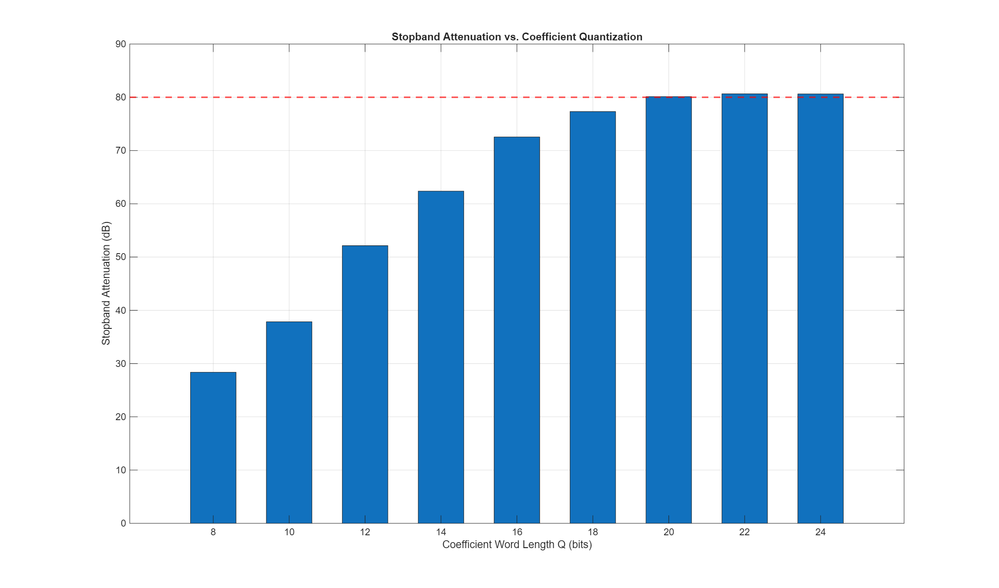

# Advanced VLSI: FIR Filter Design Project
## 1. Project Overview

The assigned class project focused on designing an FIR filter. Using the provided MATLAB workflow, I was able to quantize the coefficients and implement an equiripple lowpass FIR filter in Verilog.

### 1.1 Specification
The project specification baseline was set at 100 taps. As we will see in the design implementation section, this starting point did not produce an optimal signal-performance result because it led to large passband dB swings.  In *Table 1* below we can see the remaining design specs as found in the *FIR_Filter/Supporting Documentation/Project.pdf*.

| Parameter | Value |
|---|---|
| Filter type | Lowpass, linear phase (Type I) |
| Number of taps | 100, increase if needed |
| Passband edge | 0.20 × Nyquist |
| Stopband edge | 0.23 × Nyquist |
| Stopband attenuation | ≥ 80 dB |
| Passband ripple*| ≤ 0.5 dB |
| Design method | Parks–McClellan (`firpm`) equiripple [1][2] |

*Not a project requirement, but ideally the ripple is small to ensure signal integrity.

### 1.2 Motivation
What made this project rewarding and kept me most engaged was not just the FIR filter itself, although seeing the digital output appear correctly in the waveforms was satisfying. The real motivation came from reasoning through where the circuit could be simplified, where area could be reduced, how the critical path could be shortened, and how the overall structure could be reorganized to push performance further. That process became the most valuable part of the project because the implementation work forced the course concepts to become concrete.

## 2. Repository Structure

```
Advanced_VLSI/
├── FIR_Filter/
│   ├── coding/
│   │   ├── verilog/
│   │   │   ├── fir_basic.v                  ← Direct-form FIR
│   │   │   ├── fir_pipelined.v              ← Pipelined adder-tree FIR
│   │   │   ├── fir_parallel_L2.v            ← L=2 parallel (polyphase) FIR
│   │   │   ├── fir_parallel_L3.v            ← L=3 parallel (polyphase) FIR
│   │   │   ├── fir_parallel_L3_pipelined.v  ← L=3 parallel + pipelined adder trees
│   │   │   ├── fir_mcm.v                    ← MCM (CSD shift-add) direct-form FIR
│   │   │   ├── fir_mcm_pipelined.v          ← MCM + pipelined adder tree
│   │   │   ├── tb_fir*.v                    ← Testbenches (one per architecture)
│   │   │   └── quartus/                     ← Quartus project files, SDC, STA scripts
│   │   └── matlab/
│   │       ├── FIR_Filter_Project.m         ← MATLAB design + quantization script
│   │       └── plots/                       ← Exported MATLAB figures
│   ├── Supporting_Documentation/
│   │   └── Project.pdf
│   └── README.md
├── .gitignore
└── LICENSE
```

## 3. MATLAB Filter Design

### 3.1 Floating-Point Design
The filter was designed in firpm [2] using auto-tuned tap count and weighting, with normalized band edges of [0, 0.20, 0.23, 1]. The final design used 192 taps (order 191) with a stopband weight of 313.7. This configuration provided enough design freedom to meet the attenuation target after quantization, whereas the lower-tap starting point did not.

### 3.2 Coefficient Quantization
To determine the minimum usable coefficient precision, I ran a word-length sweep from 𝑄=14 to 24 bits and checked which cases still preserved at least 80 dB of stopband attenuation after rounding. The first setting that met the requirement was 𝑄=20, giving 21-bit signed coefficients. I then overlaid the floating-point and quantized magnitude responses to confirm that the quantized filter still tracked the intended design closely.



#### Quantization Sensitivity and Coefficient Weights
The firpm design [2] is very effective at generating the required coefficients with relatively little manual calculation. However, it also produces a wide coefficient spread. At one end, the coefficients are as small as 153, while near the middle they reach 216,278. Quantization does not account for that spread. One LSB is still one LSB, so the smaller coefficients experience a much larger relative error. A one-step rounding error on h(0) is significant, while the same one-step error on ℎ(95) is almost negligible. Unfortunately, the coefficients affected first are often the ones contributing to the more delicate behavior near the transition edge and the stopband nulls.

The Q-sweep makes this clear quickly. At Q=16, the design is not sufficient, with the stopband attenuation falling to about 72 dB. At Q=18, performance improves to roughly 78 dB, but it still misses the target. Q=20 is the first point at which the quantized design exceeds the 80 dB requirement, reaching 80.13 dB. That is where the design was finalized. The choice of 192 taps was not immediate. I began with 100 taps because that was the baseline allowed by the specification, with the option to increase the count if necessary. It was necessary. A 0.20𝜋 to 0.23π transition band combined with an 80 dB stopband target did not leave enough design margin at 100 taps, so I built a MATLAB sweep to identify a more suitable configuration. At 192 taps, the optimizer had more freedom, the stopband weight dropped to 313.7, and the quantized coefficients became much more manageable. Of course, that created a different problem: more hardware. More taps mean more multipliers, more delay storage, and a longer summation path. That is where the structural optimizations became important.

Symmetric pre-adds halve the multiplier count, reducing it from 192 to 96. Polyphase decomposition with 𝐿=2 and 𝐿=3 splits the filter into smaller subfilters of 96 and 64 taps, shortening each channel’s adder tree. Pipelined adder trees break the 7-level combinational tree into registered stages with one adder per stage, which pushes 𝐹𝑚𝑎𝑥 much higher. MCM with CSD replaces DSP multipliers with shift-add networks. This avoids hard macros, but increases ALM routing cost.

The same trade-off appeared repeatedly throughout the project. When I tried to make the arithmetic cleaner, the structure usually became heavier. When I tried to simplify the hardware, something else became harder. Much of the learning in this project came from working through that back-and-forth process rather than expecting a single obvious solution.

### 3.3 Filter Response

| Metric | Float | Quantized (Q=20) |
|---|---|---|
| Stopband attenuation | 80.61 dB | 80.13 dB |
| Passband ripple | 0.50 dB | 0.50 dB |

### 3.4 Accumulator Overflow Analysis
A 16-bit signed input multiplied by a 21-bit signed coefficient yields a 37-bit signed product. In the worst case, accumulation reaches 74,676,844,942, which requires a 38-bit internal accumulator to prevent overflow and preserve numerical correctness through the linear-phase computation.  Since most system interfaces use standard fixed word sizes, two options were considered: either widening the external output to 64 bits, which would waste a significant portion of the available range, or keeping a 32-bit signed output and saturating the final result.  This approach preserves safe internal arithmetic while maintaining compatibility with a narrower system interface. The main hardware cost is unchanged, because the 38-bit value must still propagate through the adder tree internally. The only difference is at the output boundary, where the result is saturated to 32 bits instead of exporting the full internal width.

## 4. Verilog Implementation
I kept the ModelSim flow the same for all seven architectures. That made comparison much easier. Every testbench has two phases so I can check both the impulse-response sequence and the steady-state DC behavior:

| Parameter | Value |
|---|---|
| Clock | 100 MHz (10 ns period) |
| Reset | `rst_n` held low for 50 ns, released with 20 ns settling |
| Phase 1 (Impulse) | Single-sample pulse (`din = 1`) for one clock, then zero. Captures the full 192-coefficient impulse response. |
| Phase 2 (Step) | Constant `din = 1000` sustained for the full filter depth. Verifies DC-gain convergence to `sum(coeff) × 1000 = 1,018,790,000`. |
| VCD dump | Enabled for all designs; waveforms saved under `coding/verilog/` |

Loop iterations scale by architecture to allow complete output flushing:

| Design class | Impulse cycles | Step cycles | Why |
|---|---|---|---|
| Non-pipelined, single-channel | `NUM_TAPS + 10` | `NUM_TAPS + 20` | 192 taps + margin |
| Pipelined, single-channel | `NUM_TAPS + 20` | `NUM_TAPS + 30` | extra 10 for 8-stage pipeline flush |
| L=2 parallel (non-pipelined) | `NUM_TAPS/2 + 10` | `NUM_TAPS/2 + 20` | 2 samples/clock, half the clocks |
| L=3 parallel (non-pipelined) | `NUM_TAPS/3 + 10` | `NUM_TAPS/3 + 20` | 3 samples/clock, one-third the clocks |
| L=3 parallel + pipelined | `NUM_TAPS/3 + 20` | `NUM_TAPS/3 + 30` | parallel scaling + pipeline flush |

Multi-channel designs (L=2, L=3) feed de-interleaved inputs: the impulse goes into channel 0 only (`din_0 = 1`, others zero), and the step drives all channels equally (`din_k = 1000`). Output verification checks that the interleaved coefficient sequence across channels reconstructs the original 192-tap impulse response exactly.

To compile all variants quickly in a shell environment:

Quartus: Set-Location `"[Path to project folder]\quartus"; $quartus = "[Path to quartus shell]\quartus_sh.exe"; $revisions = @('fir_basic','fir_pipelined','fir_parallel_L2','fir_parallel_L3','fir_parallel_L3_pipelined','fir_mcm','fir_mcm_pipelined'); foreach ($rev in $revisions) { & $quartus --flow compile "$rev"; if ($LASTEXITCODE -ne 0) { exit $LASTEXITCODE } }`

ModelSim:  

### 4.1 Direct-Form FIR (`fir_basic.v`)
The baseline implementation is the standard FIR realization shown in *Equation 1*. A direct 192-tap implementation would require 192 multipliers, which is costly. However, linear-phase symmetry allows the delay line to be folded into pre-add pairs, as shown in *Equation 2* [3]. The resulting structure uses 96 pre-adders, 96 multipliers, and a single combinational adder tree to reduce the products to one final sum.  Simulation results were consistent with the expected behavior. The 192-sample impulse response matched the designed coefficient set, the symmetric coefficient pairs aligned correctly, and the step response settled to 1,018,790,000, which is equal to `sum(coeff) × 1000`. This corresponds to a DC gain of approximately 0.972, or about −0.25 dB, which remains safely within the 0.5 dB passband limit.

$$y(n) = \sum_{k=0}^{N-1} h(k) \cdot x(n-k)$$
(*Equation 1*)

$$y(n) = \sum_{k=0}^{95} h(k) \,\bigl[\,x(n-k) + x(n-(191-k))\,\bigr]$$
(*Equation 2*)

### 4.2 Pipelined FIR (`fir_pipelined.v`)
The front-end structure is unchanged from `fir_basic`. The only modification is in the reduction path for the 96 products. In `fir_basic`, all 96 products are reduced through a single combinational adder tree that is 7 levels deep and padded to 128 entries. This approach works, but it requires the entire tree to settle within a single clock period. The pipelined version [3] instead inserts a register after every tree level, so each stage contains only a single two-input addition, as shown in *Equations 3* and *4*. After 7 adder stages, \(s_7(0)\) produces the final sum.  Including the product register, this adds a total latency of 8 cycles. In exchange, timing closure becomes much easier while throughput remains at 1 sample per clock. Functionally, this architecture does not change the filter output. The impulse and step responses are bit-identical to those of `fir_basic`; they simply appear later in time. Accordingly, `dout_valid` shifts from 85 ns to 165 ns, while the coefficient sequence itself remains unchanged.

$$s_0(i) =
\begin{cases}
\operatorname{product}(i), & 0 \le i < 96 \\
0, & 96 \le i < 128
\end{cases}$$
(*Equation 3*)

$$s_{m+1}(i) = \operatorname{reg}\!\left[s_m(2i) + s_m(2i{+}1)\right], \qquad m = 0, \ldots, 6$$
(*Equation 4*)

### 4.3 L=2 Parallel FIR (`fir_parallel_L2.v`)
#### Polyphase Decomposition
Decompose the transfer function into even and odd polyphase components in *Equation 5*[3] where each sub-filter has $N/2 = 96$ taps in *Equation 6*. The two output samples per clock cycle are calculated in *Equations 7* and *8*, where $x_0(n) = x(2n)$ (even input stream) and $x_1(n) = x(2n{+}1)$ (odd input stream).

$$H(z) = H_e(z^2) + z^{-1}\,H_o(z^2)$$
*(Equation 5)*

$$H_e(z) = \sum_{j=0}^{95} h(2j)\,z^{-j}, \qquad H_o(z) = \sum_{j=0}^{95} h(2j{+}1)\,z^{-j}$$
*(Equation 6)*

$$y(2n)   = \sum_{j=0}^{95} h_e(j)\,x_0(n{-}j) \;+\; \sum_{j=0}^{95} h_o(j)\,x_1(n{-}1{-}j)$$
*(Equation 7)*

$$y(2n{+}1) = \sum_{j=0}^{95} h_e(j)\,x_1(n{-}j) \;+\; \sum_{j=0}^{95} h_o(j)\,x_0(n{-}j)$$
*(Equation 8)*

#### Symmetry-Based Multiplier Reduction
From the original linear-phase symmetry $h(k) = h(191{-}k)$ we can see in *Equation 9*, $H_o$ is $H_e$ time-reversed. Substituting $h_o(j) = h_e(95{-}j)$ and re-indexing the odd sums lets us form cross pre-adds that share the same coefficient sets in *Equations 10* and *11*.  That takes the multiplier count from a naive 384 down to 192. So the L=2 version really does buy two outputs per clock without paying the full brute-force duplication cost.

$$h_e(j) = h(2j), \qquad h_o(j) = h(2j{+}1) = h(191{-}(2j{+}1)) = h(2(95{-}j)) = h_e(95{-}j)$$
*(Equation 9)*

$$y(2n)   = \sum_{j=0}^{95} h_e(j)\,\bigl[\,x_0(n{-}j) + x_1(n{-}96{+}j)\,\bigr]$$
*(Equation 10)*

$$y(2n{+}1) = \sum_{j=0}^{95} h_e(j)\,\bigl[\,x_1(n{-}j) + x_0(n{-}95{+}j)\,\bigr]$$
*(Equation 11)*

| Test | Result |
|---|---|
| Impulse response | y[2]–y[193] match all 192 coefficients in interleaved order (y\_0 gets even-indexed, y\_1 gets odd-indexed). Symmetric pairs confirmed. |
| Step response (×1000) | Both channels converge to 1,018,790,000, matching `fir_basic`. |

Latency-wise, L=2 still looks like the basic design because there is only one output register stage. The gain is throughput. Two samples come out each clock, so the simulation finishes much sooner and the VCD shrinks because the same 192 outputs flush in fewer cycles.

### 4.4 L=3 Parallel FIR (`fir_parallel_L3.v`)
#### Polyphase Decomposition (L = 3)
Decompose $H(z)$ into three polyphase branches [3] seen in *Equation 12*, where each sub-filter has $\lceil N/3 \rceil = 64$ taps as seen in *Equation 13*.  The three output samples per clock cycle are computed as seen in *Equation 14*, writing it out explicitly with $x_0(n) = x(3n)$, $x_1(n) = x(3n{+}1)$, $x_2(n) = x(3n{+}2)$ we obtain the polyphase *Equations 15, 16* and *17*, where $*$ denotes convolution with the respective polyphase sub-filter.

$$H(z) = H_0(z^3) + z^{-1}\,H_1(z^3) + z^{-2}\,H_2(z^3)$$
(*Equation 12*)

$$H_p(z) = \sum_{j=0}^{63} h(3j{+}p)\,z^{-j}, \qquad p = 0, 1, 2$$
(*Equation 13*)

$$y(3n)     = \sum_{p=0}^{2} \sum_{j=0}^{63} h_p(j)\,x_{(0-p)\bmod 3}(n - j - \lfloor p/3 \rfloor')$$
(*Equation 14*)

##### *Polyphase Equations*
$$y(3n)     = H_0 * x_0(n) \;+\; H_1 * x_2(n{-}1) \;+\; H_2 * x_1(n{-}1)$$
(*Equation 15*)

$$y(3n{+}1) = H_0 * x_1(n) \;+\; H_1 * x_0(n)     \;+\; H_2 * x_2(n{-}1)$$
(*Equation 16*)

$$y(3n{+}2) = H_0 * x_2(n) \;+\; H_1 * x_1(n)     \;+\; H_2 * x_0(n)$$
(*Equation 17*)

#### Multiplier Count

Naive L = 3 requires $3 \times 3 = 9$ sub-filter convolutions × 64 taps = **576 multipliers**. Two symmetry properties reduce this by 50 %:

1. H_0 / H_2 cross pre-add, from $h(k) = h(191{-}k)$:

$$h_0(j) = h(3j), \qquad h_2(j) = h(3j{+}2) = h(191{-}(3j{+}2)) = h(3(63{-}j)) = h_0(63{-}j)$$

So $H_2$ is $H_0$ time-reversed. Substituting and re-indexing collapses each $H_0 + H_2$ pair into a single cross pre-add:

$$y(3n) = \sum_{j=0}^{63} h_0(j)\bigl[\mathtt{dl0}[j] + \mathtt{dl1}[64{-}j]\bigr] + (H_1 \text{ term})$$

$$y(3n{+}1) = \sum_{j=0}^{63} h_0(j)\bigl[\mathtt{dl1}[j] + \mathtt{dl2}[64{-}j]\bigr] + (H_1 \text{ term})$$

$$y(3n{+}2) = \sum_{j=0}^{63} h_0(j)\bigl[\mathtt{dl2}[j] + \mathtt{dl0}[63{-}j]\bigr] + (H_1 \text{ term})$$

Each output needs **64 multipliers** for $h_0$. Total: $3 \times 64 = 192$.

2. H_1 self-symmetry fold, from the same original symmetry:

$$h_1(j) = h(3j{+}1) = h(191{-}(3j{+}1)) = h(3(63{-}j){+}1) = h_1(63{-}j)$$

H_1 is self-symmetric with 64 taps, so it folds into 32 pre-add pairs:

$$\sum_{j=0}^{63} h_1(j)\,u(j) = \sum_{j=0}^{31} h_1(j)\bigl[u(j) + u(63{-}j)\bigr]$$

Each output needs **32 multipliers** for $h_1$. Total: $3 \times 32 = 96$.

Grand total: $192 + 96 = 288$ multipliers, 50% of the naive 576.

- Interface: takes three samples per clock (`din_0`, `din_1`, `din_2`), produces three outputs per clock (`dout_0`, `dout_1`, `dout_2`).
- Throughput: **3 samples/clock** (3× fir\_basic).

All three channels checked out. The impulse response rebuilds the original coefficient sequence in 3-way interleaved order, and the step test lands at 1,018,790,000 on every output. It still has one-cycle output latency like `fir_basic`, but three samples come out each clock, so the impulse flush is much shorter and the VCD ends up being the smallest of the non-pipelined set.

### 4.5 L=3 Parallel + Pipelined FIR (`fir_parallel_L3_pipelined.v`)

This one is just the L=3 structure with the long per-channel reduction tree broken into pipeline stages. The pre-adds, symmetry reuse, and multiplier sharing all stay the same [3].

#### Pipeline Structure

Each output channel sums 96 products (64 from $H_0$ + 32 from $H_1$). These are padded to $2^7 = 128$ entries and reduced through a balanced binary tree:

$$s_0[k] = \begin{cases} \text{product}[k], & 0 \le k < 96 \\ 0, & 96 \le k < 128 \end{cases}$$

$$s_{m+1}[k] = s_m[2k] + s_m[2k{+}1], \qquad |s_{m+1}| = \tfrac{1}{2}\,|s_m| \;\text{(entries, not bit width)}$$

for $m = 0, 1, \ldots, 6$, with a pipeline register after every stage. The final sum $s_7$ is a single value per channel.

| Stage | Entries per channel | Total registers (3 ch.) |
|---|---|---|
| s0 (product reg) | 128 | 384 |
| s1 | 64 | 192 |
| s2 | 32 | 96 |
| s3 | 16 | 48 |
| s4 | 8 | 24 |
| s5 | 4 | 12 |
| s6 | 2 | 6 |
| s7 | 1 | 3 |
| Total | | 765 |

#### Latency

$$L_{\text{pipe}} = 1\;(\text{product reg}) + 7\;(\text{tree stages}) = 8 \text{ extra cycles}$$

Total latency from `din_valid` to `dout_valid`: $1\;(\text{product reg}) + 7\;(\text{tree stages}) + 1\;(\text{output reg}) = 9$ clock cycles, vs. 1 for `fir_parallel_L3`.

#### Performance Summary

| Metric | fir\_parallel\_L3 | fir\_parallel\_L3\_pipelined |
|---|---|---|
| Multipliers | 288 | 288 |
| Adder-tree depth | 96-input combinational | 7-stage registered |
| Pipeline latency | 1 cycle | 9 cycles (+8) |
| Throughput | 3 samples/clock | 3 samples/clock |
| Critical path | Pre-add → multiply → 96-product combinational adder tree | Pre-add → multiply → 2-input add (1 stage) |

- Interface: same as `fir_parallel_L3`. Takes three samples per clock (`din_0`, `din_1`, `din_2`), produces three outputs per clock (`dout_0`, `dout_1`, `dout_2`).
- `dout_valid` is generated via an 8-bit shift register that tracks `din_valid` through the pipeline.

The outputs still match `fir_parallel_L3` bit-for-bit. What changes is latency and bookkeeping. `dout_valid` shifts from 85 ns to 165 ns, the testbench runs a bit longer, and the VCD gets bigger because there are many more registers toggling.

Cumulative VCD sizes across all architectures:

| Architecture | VCD size | Sim time | vs basic |
|---|---|---|---|
| fir\_basic | 2.31 MB | 4,520 ns | — |
| fir\_pipelined | 2.58 MB | 4,520 ns | +12% |
| fir\_parallel\_L2 | 1.30 MB | 2,405 ns | −44% |
| fir\_parallel\_L3 | 0.67 MB | 1,965 ns | −71% |
| fir\_parallel\_L3\_pipelined | 0.91 MB | 2,165 ns | −61% |

#### Why Pipelined Parallel Wins on Real Hardware

If I only looked at simulation time, I could talk myself into preferring the non-pipelined L3. That would be the wrong conclusion. Both testbenches run at the same fixed 100 MHz clock, so simulation hides the real issue. On hardware, Fmax matters more than how fast a testbench transcript scrolls by, and the pipelined tree wins there for obvious reasons.

### 4.6 MCM Direct-Form FIR (`fir_mcm.v`)

This is the version where I give the DSP blocks back and pay for it in logic instead. Every multiplier in `fir_basic` becomes a Canonic Signed Digit shift-add network [3].

#### CSD Decomposition

CSD uses digits in $\{-1, 0, +1\}$ and avoids adjacent non-zero entries. In hardware terms, that matters because every non-zero digit turns into extra work. The shifts are cheap. The adds and subtracts are not.

The decomposition was generated and verified in MATLAB (`FIR_Filter_Project.m`, Section 9):
| Metric | Value |
|---|---|
| Coefficients decomposed | 96 (symmetric half) |
| Total non-zero CSD digits | 453 |
| Average NZD per coefficient | 4.7 |
| Shift-add operations | 357 (NZD − 96) |
| DSP blocks used | **0** |

#### Example Decompositions

| Coeff | Value | CSD | NZD | Verilog Expression |
|---|---|---|---|---|
| h(0) | 153 | $+2^0 - 2^3 + 2^5 + 2^7$ | 4 | `pa<<<0 - pa<<<3 + pa<<<5 + pa<<<7` |
| h(6) | 136 | $+2^3 + 2^7$ | 2 | `pa<<<3 + pa<<<7` |
| h(19) | −240 | $+2^4 - 2^8$ | 2 | `pa<<<4 - pa<<<8` |
| h(95) | 216278 | $-2^1 - 2^3 - 2^5 + 2^8 - 2^{10} + 2^{12} + 2^{14} - 2^{16} + 2^{18}$ | 9 | 8 ops (most complex) |

#### Architecture

Everything is identical to `fir_basic` except the multiply stage:

1. Delay line: 192-tap shift register (same as basic)
2. Symmetric pre-adds: 96 adders folding $\text{tap}[k] + \text{tap}[191{-}k]$ (same)
3. Products: CSD shift-add networks instead of DSP multipliers. Each `preadd[k]` is sign-extended to the 38-bit internal accumulator width, then shifted and added/subtracted per the CSD decomposition.
4. Adder tree: 7-level binary tree, pad-to-128 (same)
5. Output register: 1-cycle latency (same)

#### Common Sub-Expression Analysis

MATLAB Section 9b identifies sub-expression pairs shared across multiple coefficients. The top patterns:

| Sub-expression | Occurrences across 96 coefficients |
|---|---|
| $(x \ll a) - (x \ll a{+}2)$ | 97 |
| $(x \ll a) + (x \ll a{+}2)$ | 93 |
| $(x \ll a) - (x \ll a{+}4)$ | 59 |
| $(x \ll a) + (x \ll a{+}4)$ | 56 |

If I kept pushing this architecture, that is where I would go next. A graph-based CSE tool such as RAG-n or Hcub [3] could reuse those repeated pieces instead of rebuilding them over and over inside each coefficient network.

#### Simulation and Trade-offs

Impulse and step both match `fir_basic` exactly (same 192 coefficients, same DC gain). The downside is pretty obvious in the synthesis results. Giving up 96 DSP blocks means taking on 357 add/sub operations plus a lot of extra routing, and that is why the ALM count jumps so much. The longest CSD paths are also deeper than a single DSP multiply, so timing drops from 38.7 MHz to 33.2 MHz. So where would I actually use this? Mostly in a design where DSP blocks are tight or already reserved for something else. On this Cyclone V it is mainly a comparison point. On a smaller part, it could be the practical answer.

### 4.7 MCM Pipelined FIR (`fir_mcm_pipelined.v`)

Same CSD shift-add products as `fir_mcm`, but with the 7-stage registered adder tree from `fir_pipelined` instead of a single combinational pass. Eight extra clock cycles of latency, same as the DSP pipelined variant.

What surprised me a bit here is how well pipelining rescues the MCM version. Once the long CSD chains are cut up by registers, it reaches about 58.6 MHz, essentially the same as the DSP-pipelined design, and it still uses zero DSP blocks.

## 5. Synthesis Results

### 5.1 FPGA Target

Device: Cyclone V 5CGXFC9E7F35C8 (GX variant, F35 package, speed grade C8)

| Resource      | Available |
|---------------|-----------|
| ALMs          | 113,560   |
| DSP blocks    | 342       |
| RAM blocks    | 1,220     |
| I/O pins      | 616       |

Device choice was mostly forced by the design set [1]. The L=3 parallel versions can use 288 DSP blocks. The smaller 5CGXFC7C7F23C8 part only has 156, so that would have cut out a large part of the comparison immediately.

Timing constraint: 100 MHz target clock (`fir.sdc` in `coding/verilog/quartus/`).

### 5.2 DSP Chain Note

For the non-pipelined versions, explicit combinational reduction trees were necessary. If left alone, Quartus tried to infer DSP accumulation chains longer than the Cyclone V limit of 22 blocks. That path went nowhere.

### 5.3 38-Bit Internal Accumulator Results

| Architecture | Area (ALMs) | Registers | DSP Blocks | Fmax (MHz) | Throughput (Msps) |
|---|---|---|---|---|---|
| Direct-form | 1,125 | 3,731 | 96 | 38.7 | 38.7 |
| Pipelined | 3,042 | 9,313 | 96 | 58.7 | 58.7 |
| L=2 parallel | 1,696 | 3,659 | 192 | 37.1 | 74.1 |
| L=3 parallel | 2,499 | 3,719 | 288 | 36.4 | 109.2 |
| L=3 parallel + pipeline | 7,589 | 19,887 | 288 | 58.3 | 174.8 |
| MCM direct-form | 5,033 | 3,464 | 0 | 33.2 | 33.2 |
| MCM pipelined | 5,651 | 10,530 | 0 | 58.6 | 58.6 |

Fmax was calculated as $F_{\max} = \frac{1}{T_{clk} - \text{slack}} = \frac{1000}{10 - \text{slack (ns)}}$ using the Slow 1100 mV 85 °C model (worst-case).

- Direct-form: slack = −15.832 ns, so $F_{\max} = 1000 / 25.832 = 38.7$ MHz
- Pipelined: slack = −7.038 ns, so $F_{\max} = 1000 / 17.038 = 58.7$ MHz
- MCM direct-form: slack = −20.093 ns, so $F_{\max} = 1000 / 30.093 = 33.2$ MHz
- MCM pipelined: slack = −7.074 ns, so $F_{\max} = 1000 / 17.074 = 58.6$ MHz
- L=2 parallel: slack = −16.984 ns, so $F_{\max} = 1000 / 26.984 = 37.1$ MHz, throughput = 2 × 37.1 = 74.1 Msps
- L=3 parallel: slack = −17.465 ns, so $F_{\max} = 1000 / 27.465 = 36.4$ MHz, throughput = 3 × 36.4 = 109.2 Msps
- L=3 pipelined: slack = −7.166 ns, so $F_{\max} = 1000 / 17.166 = 58.3$ MHz, throughput = 3 × 58.3 = 174.8 Msps

### 5.4 Interconnect Usage

Routing resource utilisation from the Quartus Fitter (average and peak interconnect congestion):

| Architecture | Avg Interconnect (total/H/V) | Peak Interconnect (total/H/V) | Block IC | Fan-out (avg) | Fan-out (max) |
|---|---|---|---|---|---|
| Direct-form | 2.1% / 1.7% / 3.5% | 22.9% / 19.6% / 35.1% | 8,861 (1%) | 3.86 | 3,827 |
| Pipelined | 2.1% / 1.9% / 2.6% | 16.5% / 15.1% / 20.7% | 15,072 (2%) | 3.09 | 9,457 |
| L=2 parallel | 6.5% / 5.5% / 9.7% | 32.8% / 29.6% / 47.1% | 15,785 (2%) | 4.20 | 3,851 |
| L=3 parallel | 12.0% / 9.9% / 18.9% | 39.6% / 36.6% / 62.2% | 22,537 (3%) | 4.48 | 4,007 |
| L=3 parallel + pipeline | 8.9% / 7.6% / 13.1% | 20.9% / 18.4% / 33.3% | 41,703 (6%) | 3.00 | 20,319 |
| MCM direct-form | 2.1% / 2.1% / 2.2% | 31.5% / 30.7% / 34.1% | 19,381 (3%) | 3.14 | 3,464 |
| MCM pipelined | 2.0% / 2.0% / 1.9% | 20.5% / 21.4% / 17.8% | 21,255 (3%) | 2.99 | 10,530 |

The routing numbers matter more here than the prose around them:
- L=3 parallel has the worst interconnect by a wide margin: 12.0% average (still about 1.8x L=2) and 62.2% vertical peak. Three data buses feeding 288 DSP blocks saturate the vertical routing channels between DSP columns.
- L=2 parallel sits at 6.5% average and 47.1% vertical peak. Double the data buses, roughly double the wiring.
- Adding pipelining to L=3 still helps routing materially: peak vertical congestion drops from 62.2% to 33.3%, and average interconnect drops from 12.0% to 8.9%. The pipeline registers let the fitter spread logic across more of the chip. The tradeoff is nearly 20K registers driving 6% block interconnect and a max fan-out of 20,319.
- MCM direct-form still has high peak congestion (31.5%) despite low average, because the CSD shift-add chains create localised routing hotspots around the large-coefficient products. The pipelined MCM cuts that to 20.5% by breaking up the long combinational paths.
- DSP pipelined has the lowest peak in the current runs at 16.5%, thanks to dedicated routing inside the DSP columns.

One point where this became very obvious: I spent a long time staring at the L=3 parallel timing reports before it finally clicked that the vertical routing channels were getting hammered. Once I looked at the interconnect report instead of only the slack number, the problem made much more sense.

### 5.5 Critical Path Delay Breakdown

The earlier CELL-versus-IC breakdown table was generated from a separate manual `report_timing -detail full_path` pass. That custom timing report was not regenerated in the current standardized Quartus rerun, so I removed the stale table rather than leave mismatched numbers here. The current source-of-truth tables in this section now come directly from the latest `.fit.summary`, `.sta.summary`, `.fit.rpt`, and `.pow.summary` files.

### 5.6 Power Estimation

These numbers came from Quartus Prime PowerPlay with vectorless estimation and the default 12.5% toggle rate. So I treated them as ranking data, not absolute truth. Static power barely moves. Dynamic power is the part worth looking at.

| Architecture | Dynamic (mW) | Static (mW) | I/O (mW) | Total (mW) |
|---|---|---|---|---|
| Direct-form | 39.0 | 519.1 | 6.7 | 564.8 |
| Pipelined | 100.5 | 519.9 | 6.7 | 627.1 |
| L=2 parallel | 73.3 | 519.5 | 6.7 | 599.6 |
| L=3 parallel | 105.7 | 520.0 | 6.7 | 632.3 |
| L=3 parallel + pipeline | 343.9 | 523.1 | 6.7 | 873.7 |
| MCM direct-form | 17.9 | 518.8 | 6.7 | 543.4 |
| MCM pipelined | 30.7 | 519.0 | 6.7 | 556.4 |

First thing that jumps out: the MCM versions use much less dynamic power than the DSP-heavy versions. That part was not too surprising.

At the other end, L=3 pipelined is expensive in power by a wide margin. Three channels. Deep registered trees. 100 MHz. The result is not subtle. More generally, every time timing improved because of extra registers, power pushed the other way.

One important caveat: these are not activity-driven estimates. They are good enough for ranking the architectures, but I would not treat them as final power-budget numbers.

## 6. Further Analysis and Conclusion

### 6.1 Architecture Comparison

Putting everything on the same throughput-efficiency footing makes the trade-offs easier to see. The numbers below use the 38-bit internal-accumulator results, which still match the current RTL because only the external interface was narrowed to 32 bits and saturated.

| Architecture | Fmax (MHz) | Throughput (Msps) | ALMs | DSPs | Dynamic Power (mW) | Throughput/ALM (Ksps/ALM) | Throughput/mW (Msps/mW) |
|---|---|---|---|---|---|---|---|
| Direct-form | 38.7 | 38.7 | 1,125 | 96 | 39.0 | 34.4 | 0.99 |
| Pipelined | 58.7 | 58.7 | 3,042 | 96 | 100.5 | 19.3 | 0.58 |
| L=2 parallel | 37.1 | 74.1 | 1,696 | 192 | 73.3 | 43.7 | 1.01 |
| L=3 parallel | 36.4 | 109.2 | 2,499 | 288 | 105.7 | 43.7 | 1.03 |
| L=3 parallel + pipeline | 58.3 | 174.8 | 7,589 | 288 | 343.9 | 23.0 | 0.51 |
| MCM direct-form | 33.2 | 33.2 | 5,033 | 0 | 17.9 | 6.6 | 1.86 |
| MCM pipelined | 58.6 | 58.6 | 5,651 | 0 | 30.7 | 10.4 | 1.91 |

The clearest takeaway from the table is simple: once the filter gets this large, pipelining stops being optional. DSP, MCM, parallel, it does not matter much. The pipelined versions all end up clustered around 58.3 to 58.7 MHz. Without those registers, the reduction tree pulls Fmax back into the low-to-high 30 MHz range.

Polyphase parallelism behaved about the way it should. Throughput scales almost linearly with the parallel factor. Per-channel timing stays in the same neighborhood. The non-pipelined L=2 and L=3 versions look especially good in throughput per ALM because they are not carrying the extra register overhead of deep pipelines. If all I care about is raw throughput, L=3 plus pipelining wins, but not cheaply.

MCM with CSD ends up in a very specific corner of the design space. Worse in ALMs. Better in DSP usage. Better than I expected in power efficiency. That makes it attractive if DSP blocks matter more than logic. It also still feels unfinished, in a good way. The repeated CSE patterns from Section 4.6 suggest that a smarter optimizer could trim the shift-add count quite a bit further.

### 6.2 Hybrid MCM-DSP Architecture (Future Work)

One thing I didn't build but would like to try: a hybrid where the small-magnitude coefficients (low NZD, like h(6) = 136 = `+2^3 + 2^7`, just 2 operations) stay in CSD shift-add fabric, while the big coefficients (h(95) = 216,278 with 9 NZD and 8 cascaded operations) get mapped to DSP blocks. That would cut ALM usage versus pure MCM by offloading the most complex shift-add chains, cut DSP usage versus pure DSP by keeping the roughly 30 coefficients with NZD ≤ 3 in fabric (1 to 2 adders each, way cheaper than a dedicated DSP block), and shorten the critical path since the longest CSD chains currently set the MCM Fmax ceiling at 33.2 MHz.

The partitioning threshold (how many NZD before a coefficient "deserves" a DSP) is itself an optimisation problem trading ALMs, DSPs, power, and timing closure. Natural next step from this project.

### 6.3 Conclusion

By the end, this project felt less like just building a FIR filter and more like repeatedly asking how much farther the same design could be pushed with better structural decisions.

Quantization was manageable, but only once I stopped treating it like a side detail. Q=20 ended up being the point where the stopband target survived rounding without making the coefficients wider than they needed to be. Getting there by moving beyond the 100-tap starting point made the numeric problem easier and the hardware problem harder.

For timing, pipelining was the strongest lever by far. Once the reduction tree was broken up stage by stage, all of the pipelined versions clustered around 58.3 to 58.7 MHz. Without it, the long combinational sum path kept the clock down in the 33 to 39 MHz range. That was one of the places where the data made the design choice pretty hard to argue with.

Polyphase decomposition was the cleanest way I found to buy throughput. The non-pipelined L=3 version, in particular, gets a lot done for the amount of hardware it uses. That was one of the clearer moments where a course concept stopped being a diagram and turned into a number I could actually compare.

The MCM/CSD path also ended up being more than a curiosity. It gives up timing and logic area, but it frees every DSP block and does it with the lowest dynamic power in the set. Working through those trade-offs, especially where area or path depth could be cut, was a big part of what made the project worthwhile from a learning standpoint.

## 7. Open-Ended Final Design Project

Selected topic: Viterbi decoder, high-performance VLSI architecture and RTL implementation.

## 8. References

[1] Course Project Specification: `Supporting_Documentation/Project.pdf`

[2] MATLAB `firpm` documentation: https://www.mathworks.com/help/signal/ref/firpm.html

[3] K. K. Parhi, *VLSI Digital Signal Processing Systems: Design and Implementation*, Wiley, 1999, Ch. 8–11.

## 9. Acknowledgements

GitHub Copilot was used primarily to improve efficiency. Because this work required seven separate Quartus runs, there was a significant amount of repetitive compile-check-report effort. Copilot helped accelerate that workflow by assisting with routine iteration, identifying obvious warnings or errors, and helping review timing and area reports. However, the underlying design decisions, RTL development, and analysis were my own. Its role was limited to reducing the overhead of repetitive tasks.
