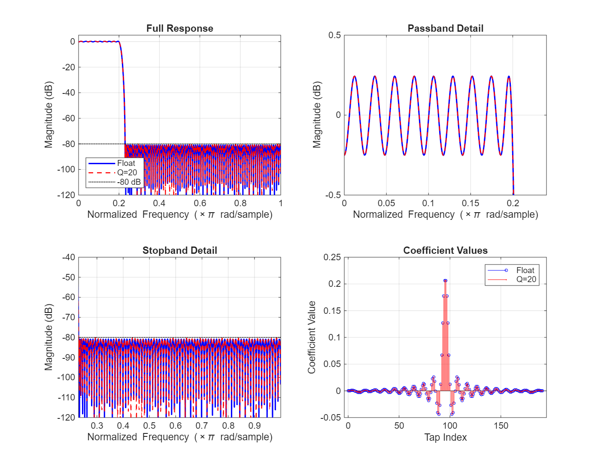

# Advanced VLSI — FIR Filter Design Project

## 1. Project Overview

Design, quantize, and implement an **equiripple lowpass FIR filter** in Verilog, targeting high-performance VLSI architectures with reduced-complexity parallel processing (L = 2, L = 3).

| Parameter | Value |
|---|---|
| Filter type | Lowpass, linear phase (Type I) |
| Number of taps | Auto-tuned (starts at 100, increased if needed) |
| Passband edge | 0.20 × Nyquist |
| Stopband edge | 0.23 × Nyquist |
| Stopband attenuation | ≥ 80 dB |
| Passband ripple | ≤ 0.5 dB |
| Design method | Parks–McClellan (`firpm`) equiripple |

> FIR filters are inherently stable and can guarantee exactly linear phase — desirable properties for hardware signal processing and signal integrity.

## 2. Repository Structure

```
Advanced_VLSI/
├── FIR_Filter/
│   ├── coding/
│   │   ├── verilog/
│   │   │   ├── OVERFLOW_PREVENT/            ← 192-tap, 38-bit accumulator (no overflow possible)
│   │   │   │   ├── fir_basic.sv             ← Direct-form FIR
│   │   │   │   ├── fir_pipelined.sv         ← Pipelined adder-tree FIR
│   │   │   │   ├── fir_parallel_L2.sv       ← L=2 parallel (polyphase) FIR
│   │   │   │   ├── fir_parallel_L3.sv       ← L=3 parallel (polyphase) FIR
│   │   │   │   ├── fir_parallel_L3_pipelined.sv ← L=3 parallel + pipelined adder trees
│   │   │   │   ├── fir_mcm.sv               ← MCM (CSD shift-add) direct-form FIR
│   │   │   │   ├── fir_mcm_pipelined.sv     ← MCM + pipelined adder tree
│   │   │   │   ├── tb_fir*.sv               ← Testbenches (one per architecture)
│   │   │   │   └── quartus/                 ← Quartus project files, SDC, STA scripts
│   │   │   └── OVERFLOW_CONTROL/            ← (next phase: 128-tap, narrower accumulator + saturation)
│   │   └── matlab/
│   │       ├── OVERFLOW_PREVENT/
│   │       │   ├── FIR_Filter_Project.m      ← MATLAB design + quantization script
│   │       │   └── plots/                   ← Exported MATLAB figures
│   │       └── OVERFLOW_CONTROL/            ← (next phase)
│   ├── Supporting_Documentation/
│   │   └── Project.pdf
│   └── README.md
├── .gitignore
└── LICENSE
```

## 3. MATLAB Filter Design

### 3.1 Floating-Point Design
- `firpm` with auto-tuned tap count and weights; band edges `[0 0.20 0.23 1]`.
- Final design: **192 taps** (order 191), stopband weight 313.7.
- Passband ripple and stopband attenuation reported automatically.

### 3.2 Coefficient Quantization
- Word-length sweep (Q = 8 to 24 bits) to find the **minimum Q** that preserves ≥ 80 dB stopband after rounding.
- **Selected: Q = 20 bits** (21-bit signed coefficients).
- Side-by-side floating-point vs. quantized magnitude response:


#### Quantization Sensitivity and Coefficient Weights

The equiripple design (`firpm`) distributes approximation error evenly across the stopband, but the resulting coefficients span a wide dynamic range — from h(0) = 153 to h(95) = 216,278, a ratio of over 1400:1. Quantization affects large-magnitude coefficients disproportionately: rounding a coefficient near 216,278 by one LSB (at Q = 20, LSB ≈ 1) shifts it by < 0.001 %, whereas rounding h(0) = 153 by one LSB changes it by 0.65 %. These small coefficients shape the transition band edges and stopband nulls, so even modest rounding errors can degrade the attenuation floor.

The Q-sweep confirms this: at Q = 16 (LSB ≈ 15), the quantized stopband attenuation drops to ~72 dB — the small passband-edge coefficients lose precision first, widening the transition band and raising stopband sidelobes. At Q = 18, attenuation recovers to ~78 dB but still falls short. Q = 20 is the first word length to exceed the 80 dB target (80.13 dB), with only 0.48 dB of degradation from the floating-point design (80.61 dB).

Increasing the tap count to 192 (from the minimum 100 specified) was necessary because 100 taps could not achieve 80 dB in the narrow 0.20π–0.23π transition band even at floating point. The higher tap count allows the optimiser to use smaller coefficient weights — the stopband weight dropped from thousands (for 100 taps) to 313.7 for 192 taps — which in turn reduces the dynamic range of the coefficient set and makes quantization less destructive. However, more taps directly increase hardware complexity: 192 taps → 96 multipliers, deeper adder trees, and wider delay lines. This complexity was managed through:

- **Strength reduction:** symmetric pre-adds halve the multiplier count (192 → 96).
- **Algorithmic decomposition:** polyphase L=2 and L=3 partition the filter into smaller sub-filters (96-tap and 64-tap), reducing per-channel adder tree depth.
- **Pipelining:** registered adder trees break the critical path from $O(96)$ adder levels to a single 2-input add per stage, dramatically improving Fmax.
- **MCM with CSD:** replacing DSP multipliers with shift-add networks eliminates expensive hard-macro usage at the cost of additional ALM wiring.

The balance between tap count, quantization word length, and architectural complexity is delicate — fewer taps require higher coefficient precision (larger Q) and higher stopband weight, while more taps relax quantization requirements but scale hardware resources linearly.

### 3.3 Filter Response



| Metric | Float | Quantized (Q=20) |
|---|---|---|
| Stopband attenuation | 80.61 dB | 80.13 dB |
| Passband ripple | 0.50 dB | 0.50 dB |

### 3.4 Coefficient Symmetry
- Linear-phase Type I symmetry verified: `b(k) == b(193−k)` for all 96 pairs.
- Only **96 unique multipliers** required (half of 192 taps).

### 3.5 Accumulator Overflow Analysis
- 16-bit signed input × 21-bit signed coefficients → 37-bit multiply.
- Worst-case accumulator value: 74,676,844,942 → **38-bit accumulator**.
- **Overflow is impossible** — no saturation or clipping logic needed.

This is an **architectural overflow prevention** strategy: the accumulator is sized to the worst-case sum-of-absolute-coefficients × max input, guaranteeing that no combination of inputs can ever overflow. This ensures correct convergence for all signal conditions without saturation, clipping, or wrap-around logic, at the cost of wider datapaths (38 bits through the entire adder tree). The 192-tap design exacerbates this — the pad-to-128 adder tree carries 38-bit operands at every node, contributing to the routing congestion and area overhead visible in the synthesis results (Section 5).

An alternative approach would allow **controlled overflow** with narrower accumulators (e.g., 32-bit) and saturating arithmetic or convergent rounding. This would reduce datapath width by 6 bits at every adder-tree node, shrinking ALM usage and routing pressure, but requires additional saturation/clipping logic and careful analysis of signal statistics to ensure the overflow rate is acceptably low for the application.

## 4. SystemVerilog Implementation

All seven architectures share a common testbench methodology, verified in ModelSim Intel FPGA Edition 10.5b. Each testbench applies the same two-phase stimulus:

| Parameter | Value |
|---|---|
| Clock | 100 MHz (10 ns period) |
| Reset | `rst_n` held low for 50 ns, released with 20 ns settling |
| **Phase 1 — Impulse** | Single-sample pulse (`din = 1`) for one clock cycle, then zero. Captures the full impulse response (all 192 coefficients). |
| **Phase 2 — Step** | Constant input (`din = 1000`) sustained for the full filter depth. Verifies DC-gain convergence to `sum(coeff) × 1000 = 1,018,790,000`. |
| VCD dump | Enabled for all designs; waveforms saved to `coding/verilog/OVERFLOW_PREVENT/*.vcd` |

Loop iterations scale by architecture to allow complete output flushing:

| Design class | Impulse cycles | Step cycles | Rationale |
|---|---|---|---|
| Non-pipelined, single-channel | `NUM_TAPS + 10` | `NUM_TAPS + 20` | 192 taps + margin |
| Pipelined, single-channel | `NUM_TAPS + 20` | `NUM_TAPS + 30` | +10 extra for 8-stage pipeline flush |
| L=2 parallel (non-pipelined) | `NUM_TAPS/2 + 10` | `NUM_TAPS/2 + 20` | 2 samples/clock → half the clocks |
| L=3 parallel (non-pipelined) | `NUM_TAPS/3 + 10` | `NUM_TAPS/3 + 20` | 3 samples/clock → one-third the clocks |
| L=3 parallel + pipelined | `NUM_TAPS/3 + 20` | `NUM_TAPS/3 + 30` | Parallel scaling + pipeline flush |

Multi-channel designs (L=2, L=3) feed de-interleaved inputs: the impulse is injected on channel 0 only (`din_0 = 1`, others zero), and the step drives all channels equally (`din_k = 1000`). Output verification confirms that the interleaved coefficient sequence across channels reconstructs the original 192-tap impulse response exactly.

### 4.1 Direct-Form FIR (`fir_basic.sv`)

The standard FIR convolution sum for an $N$-tap filter:

$$y(n) = \sum_{k=0}^{N-1} h(k) \cdot x(n-k)$$

For $N = 192$ this requires 192 multipliers. Exploiting the linear-phase (Type I) symmetry $h(k) = h(N{-}1{-}k)$, we fold the delay line into **pre-add pairs**:

$$y(n) = \sum_{k=0}^{95} h(k) \,\bigl[\,x(n-k) + x(n-(191-k))\,\bigr]$$

This halves the multiplier count to **96 pre-adds + 96 multiplies**. The products are then reduced by a combinational adder tree.

| Test | Result |
|---|---|
| Impulse response | y[1]–y[192] match all 192 coefficients exactly; symmetric pairs confirmed (e.g., y[1]=y[192]=153, y[95]=y[98]=185938). Zeros before and after. |
| Step response (×1000) | Converges to steady-state 1,018,790,000 = `sum(coeff) × 1000`. In Q20: 1,018,790 / 1,048,576 ≈ 0.972 (−0.25 dB), within the 0.5 dB passband spec. |
| Overflow | No overflow observed — 38-bit accumulator sufficient as predicted. |

### 4.2 Pipelined FIR (`fir_pipelined.sv`)

The pre-add + multiply datapath is identical to `fir_basic.sv`. The critical-path optimization targets the adder tree that reduces 96 products to a single sum.

In `fir_basic`, all 96 products are summed in a single combinational pass — critical path $O(96)$ adders. The pipelined version inserts **registers** at every level of a binary tree, breaking the path into $\lceil \log_2(96) \rceil = 7$ stages.

The 96 products are zero-padded to $N_{\text{pad}} = 2^7 = 128$ for a balanced tree:

$$s_0(i) = \begin{cases} \text{product}(i) & 0 \le i < 96 \\ 0 & 96 \le i < 128 \end{cases}$$

Each subsequent stage halves the count with a registered add:

$$s_{m+1}(i) = \text{reg}\bigl[\,s_m(2i) + s_m(2i{+}1)\,\bigr], \qquad m = 0,\dots,6$$

After 7 stages: $s_7(0)$ is the final sum. Including the product register (stage 0), total pipeline latency is:

$$L_{\text{pipe}} = 1 + 7 = 8 \text{ clock cycles}$$

Throughput remains **1 sample/clock** but at significantly higher Fmax.

| Test | Result |
|---|---|
| Impulse response | Bit-identical to `fir_basic` — all 192 coefficients match exactly. |
| Step response (×1000) | Converges to 1,018,790,000 — same DC gain as `fir_basic`. |
| Functional equivalence | Output values identical to direct-form; only latency differs (+8 cycles). |

#### Latency Analysis (from VCD waveforms)

| Event | fir\_basic | fir\_pipelined | Delta |
|---|---|---|---|
| Reset released (`rst_n = 1`) | 50 ns | 50 ns | — |
| First `din_valid` sampled | 85 ns | 85 ns | — |
| **`dout_valid` asserted** | **85 ns** | **165 ns** | **+80 ns (+8 clk)** |
| First non-zero `dout` | 95 ns | 175 ns | +80 ns (+8 clk) |

The 8-cycle latency delta exactly matches the pipeline architecture: 1 product register stage + 7 binary adder-tree stages = 8 extra clock cycles.

#### Output Verification (bit-identical)

The first four non-zero impulse-response outputs are identical in both VCD dumps, confirming functional equivalence:

| Sample | `dout` (binary) | `dout` (decimal) |
|---|---|---|
| 0 | `10011001` | 153 |
| 1 | `100111101` | 317 |
| 2 | `1000011100` | 540 |
| 3 | `1011100001` | 737 |

These values correspond to the first four quantized FIR coefficients (h[0]–h[3]), matching the MATLAB-generated coefficient table exactly.

### 4.3 L=2 Parallel FIR (`fir_parallel_L2.sv`)

#### Polyphase Decomposition

Decompose the transfer function into even and odd polyphase components:

$$H(z) = H_e(z^2) + z^{-1}\,H_o(z^2)$$

where each sub-filter has $N/2 = 96$ taps:

$$H_e(z) = \sum_{j=0}^{95} h(2j)\,z^{-j}, \qquad H_o(z) = \sum_{j=0}^{95} h(2j{+}1)\,z^{-j}$$

The two output samples per clock cycle are:

$$y(2n)   = \sum_{j=0}^{95} h_e(j)\,x_0(n{-}j) \;+\; \sum_{j=0}^{95} h_o(j)\,x_1(n{-}1{-}j)$$

$$y(2n{+}1) = \sum_{j=0}^{95} h_e(j)\,x_1(n{-}j) \;+\; \sum_{j=0}^{95} h_o(j)\,x_0(n{-}j)$$

where $x_0(n) = x(2n)$ (even input stream) and $x_1(n) = x(2n{+}1)$ (odd input stream).

#### Symmetry-Based Multiplier Reduction

From the original linear-phase symmetry $h(k) = h(191{-}k)$:

$$h_e(j) = h(2j), \qquad h_o(j) = h(2j{+}1) = h(191{-}(2j{+}1)) = h(2(95{-}j)) = h_e(95{-}j)$$

So $H_o$ is $H_e$ **time-reversed**. Substituting $h_o(j) = h_e(95{-}j)$ and re-indexing the odd sums lets us form **cross pre-adds** that share the same coefficient set:

$$y(2n)   = \sum_{j=0}^{95} h_e(j)\,\bigl[\,x_0(n{-}j) + x_1(n{-}96{+}j)\,\bigr]$$

$$y(2n{+}1) = \sum_{j=0}^{95} h_e(j)\,\bigl[\,x_1(n{-}j) + x_0(n{-}95{+}j)\,\bigr]$$

This reduces the multiplier count from $4 \times 96 = 384$ (naive) to $2 \times 96 = 192$ (**50 % reduction**). Each output requires only 96 multiplications by $h_e(j)$.

- Interface: accepts two samples per clock (`din_0`, `din_1`), produces two outputs per clock (`dout_0`, `dout_1`).
- Throughput: **2 samples/clock** (2× fir\_basic).

| Test | Result |
|---|---|
| Impulse response | y[2]–y[193] match all 192 coefficients exactly in interleaved order (y\_0 = h(0), h(2), …; y\_1 = h(1), h(3), …). Symmetric pairs confirmed (e.g., y[2]=y[193]=153, y[96]=y[99]=185938). Zeros before and after. |
| Step response (×1000) | Both y\_0 and y\_1 converge to steady-state 1,018,790,000 — same DC gain as `fir_basic`. |
| Functional equivalence | Interleaved output sequence identical to `fir_basic`; 2× throughput. |

#### Latency Analysis (from VCD waveform)

| Event | fir\_basic | fir\_parallel\_L2 | Delta |
|---|---|---|---|
| Reset released (`rst_n = 1`) | 50 ns | 50 ns | — |
| First `din_valid` sampled | 85 ns | 85 ns | — |
| **`dout_valid` asserted** | **85 ns** | **85 ns** | **0 (same)** |
| First non-zero `dout` | 95 ns | 95 ns | 0 (same) |
| Simulation end | 4,520 ns | 2,405 ns | −47 % |

Latency is identical to `fir_basic` — one output-register stage, no additional pipeline.

#### Output Verification (bit-identical, interleaved)

The first three non-zero outputs from each channel match the even/odd FIR coefficients exactly:

| Cycle | `dout_0` (decimal) | Expected h(2k) | `dout_1` (decimal) | Expected h(2k+1) |
|---|---|---|---|---|
| 1 | 153 | h(0) = 153 | 317 | h(1) = 317 |
| 2 | 540 | h(2) = 540 | 737 | h(3) = 737 |
| 3 | 802 | h(4) = 802 | 626 | h(5) = 626 |

#### VCD Size Comparison

The L2 dump is **44 % smaller** than `fir_basic` (1.30 MB vs 2.31 MB) despite having two output buses. This is because the L2 design processes the full 192-tap impulse in only 96 parallel clocks — fewer timestamps mean fewer signal-change entries in the VCD.

### 4.4 L=3 Parallel FIR (`fir_parallel_L3.sv`)

#### Polyphase Decomposition (L = 3)

Decompose $H(z)$ into three polyphase branches:

$$H(z) = H_0(z^3) + z^{-1}\,H_1(z^3) + z^{-2}\,H_2(z^3)$$

where each sub-filter has $\lceil N/3 \rceil = 64$ taps:

$$H_p(z) = \sum_{j=0}^{63} h(3j{+}p)\,z^{-j}, \qquad p = 0, 1, 2$$

The three output samples per clock cycle are computed as:

$$y(3n)     = \sum_{p=0}^{2} \sum_{j=0}^{63} h_p(j)\,x_{(0-p)\bmod 3}(n - j - \lfloor p/3 \rfloor')$$

More concretely, defining $x_0(n) = x(3n)$, $x_1(n) = x(3n{+}1)$, $x_2(n) = x(3n{+}2)$:

$$y(3n)     = H_0 * x_0(n) \;+\; H_1 * x_2(n{-}1) \;+\; H_2 * x_1(n{-}1)$$

$$y(3n{+}1) = H_0 * x_1(n) \;+\; H_1 * x_0(n)     \;+\; H_2 * x_2(n{-}1)$$

$$y(3n{+}2) = H_0 * x_2(n) \;+\; H_1 * x_1(n)     \;+\; H_2 * x_0(n)$$

where $*$ denotes convolution with the respective polyphase sub-filter.

#### Multiplier Count

Naive L = 3 requires $3 \times 3 = 9$ sub-filter convolutions × 64 taps = **576 multipliers**. Two symmetry properties reduce this by 50 %:

**1. H_0 / H_2 cross pre-add** — from $h(k) = h(191{-}k)$:

$$h_0(j) = h(3j), \qquad h_2(j) = h(3j{+}2) = h(191{-}(3j{+}2)) = h(3(63{-}j)) = h_0(63{-}j)$$

So $H_2$ is $H_0$ time-reversed. Substituting and re-indexing collapses each $H_0 + H_2$ pair into a single cross pre-add:

$$y(3n) = \sum_{j=0}^{63} h_0(j)\bigl[\text{dl\_0}[j] + \text{dl\_1}[64{-}j]\bigr] + \text{(H_1 term)}$$

$$y(3n{+}1) = \sum_{j=0}^{63} h_0(j)\bigl[\text{dl\_1}[j] + \text{dl\_2}[64{-}j]\bigr] + \text{(H_1 term)}$$

$$y(3n{+}2) = \sum_{j=0}^{63} h_0(j)\bigl[\text{dl\_2}[j] + \text{dl\_0}[63{-}j]\bigr] + \text{(H_1 term)}$$

Each output needs **64 multipliers** for $h_0$. Total: $3 \times 64 = 192$.

**2. H_1 self-symmetry fold** — from the same original symmetry:

$$h_1(j) = h(3j{+}1) = h(191{-}(3j{+}1)) = h(3(63{-}j){+}1) = h_1(63{-}j)$$

H_1 is self-symmetric with 64 taps, so it folds into 32 pre-add pairs:

$$\sum_{j=0}^{63} h_1(j)\,u(j) = \sum_{j=0}^{31} h_1(j)\bigl[u(j) + u(63{-}j)\bigr]$$

Each output needs **32 multipliers** for $h_1$. Total: $3 \times 32 = 96$.

**Grand total: $192 + 96 = 288$ multipliers** (50 % of naive 576).

- Interface: accepts three samples per clock (`din_0`, `din_1`, `din_2`), produces three outputs per clock (`dout_0`, `dout_1`, `dout_2`).
- Throughput: **3 samples/clock** (3× fir\_basic).

| Test | Result |
|---|---|
| Impulse response | y[3]–y[194] match all 192 coefficients exactly in 3-way interleaved order (y\_0 = h(0), h(3), …; y\_1 = h(1), h(4), …; y\_2 = h(2), h(5), …). Symmetric pairs confirmed (e.g., y[3]=y[194]=153). Zeros before and after. |
| Step response (×1000) | All three outputs (y\_0, y\_1, y\_2) converge to steady-state 1,018,790,000 — same DC gain as `fir_basic`. |
| Functional equivalence | Interleaved output sequence identical to `fir_basic`; 3× throughput. |

#### Latency Analysis (from VCD waveform)

| Event | fir\_basic | fir\_parallel\_L3 | Delta |
|---|---|---|---|
| Reset released (`rst_n = 1`) | 50 ns | 50 ns | — |
| First `din_valid` sampled | 85 ns | 85 ns | — |
| **`dout_valid` asserted** | **85 ns** | **85 ns** | **0 (same)** |
| First non-zero `dout` | 95 ns | 95 ns | 0 (same) |
| Simulation end | 4,520 ns | 1,965 ns | −57 % |

Latency is identical to `fir_basic` — one output-register stage, no additional pipeline.

#### Output Verification (bit-identical, interleaved)

The first three non-zero outputs from each channel match the polyphase FIR coefficients exactly:

| Cycle | `dout_0` (decimal) | Expected h(3k) | `dout_1` (decimal) | Expected h(3k+1) | `dout_2` (decimal) | Expected h(3k+2) |
|---|---|---|---|---|---|---|
| 1 | 153 | h(0) = 153 | 317 | h(1) = 317 | 540 | h(2) = 540 |
| 2 | 737 | h(3) = 737 | 802 | h(4) = 802 | 626 | h(5) = 626 |
| 3 | 136 | h(6) = 136 | −660 | h(7) = −660 | −1648 | h(8) = −1648 |

#### VCD Size Comparison

The L3 dump is the smallest of the non-pipelined designs (0.67 MB, −71 % vs basic) — processing three samples per clock requires only $\lceil 192/3 \rceil = 64$ parallel clocks to flush the impulse, cutting the number of VCD timestamps (and thus file size) roughly in proportion. See the cumulative VCD table in Section 4.5 for all architectures.

### 4.5 L=3 Parallel + Pipelined FIR (`fir_parallel_L3_pipelined.sv`)

Combines the **L=3 polyphase decomposition** from Section 4.4 with the **pipelined binary adder tree** from Section 4.2. The pre-add/multiply datapath and symmetry optimisations are identical to `fir_parallel_L3`; the only change is that the three combinational adder trees (one per output channel) are replaced with registered 7-stage binary adder trees.

#### Pipeline Structure

Each output channel sums 96 products (64 from $H_0$ + 32 from $H_1$). These are padded to $2^7 = 128$ entries and reduced through a balanced binary tree:

$$s_0[k] = \begin{cases} \text{product}[k], & 0 \le k < 96 \\ 0, & 96 \le k < 128 \end{cases}$$

$$s_{m+1}[k] = s_m[2k] + s_m[2k{+}1], \qquad \text{width}(s_{m+1}) = \tfrac{1}{2}\,\text{width}(s_m)$$

for $m = 0, 1, \ldots, 6$, with a pipeline register after every stage. The final sum $s_7$ is a single value per channel.

| Stage | Entries per channel | Total registers (3 ch.) |
|---|---|---|
| s0 (product reg) | 128 | 384 |
| s1 | 64 | 192 |
| s2 | 32 | 96 |
| s3 | 16 | 48 |
| s4 | 8 | 24 |
| s5 | 4 | 12 |
| s6 | 2 | 6 |
| s7 | 1 | 3 |
| **Total** | | **765** |

#### Latency

$$L_{\text{pipe}} = 1\;(\text{product reg}) + 7\;(\text{tree stages}) = 8 \text{ extra cycles}$$

Total latency from `din_valid` to `dout_valid`: $1\;(\text{product reg}) + 7\;(\text{tree stages}) + 1\;(\text{output reg}) = 9$ clock cycles, vs. 1 for `fir_parallel_L3`.

#### Performance Summary

| Metric | fir\_parallel\_L3 | fir\_parallel\_L3\_pipelined |
|---|---|---|
| Multipliers | 288 | 288 |
| Adder-tree depth | 96-input combinational | 7-stage registered |
| Pipeline latency | 1 cycle | 9 cycles (+8) |
| Throughput | 3 samples/clock | 3 samples/clock |
| Critical path | Pre-add → multiply → 96-input adder chain | Pre-add → multiply → 2-input add (1 stage) |

- Interface: identical to `fir_parallel_L3` — accepts three samples per clock (`din_0`, `din_1`, `din_2`), produces three outputs per clock (`dout_0`, `dout_1`, `dout_2`).
- `dout_valid` is generated via an 8-bit shift register that tracks `din_valid` through the pipeline.

| Test | Result |
|---|---|
| Impulse response | y[3]–y[194] match all 192 coefficients exactly in 3-way interleaved order — bit-identical to `fir_parallel_L3`. First valid output triplet (y[0]–y[2]) is zero due to pipeline fill. Symmetric pairs confirmed (e.g., y[3]=y[194]=153, y[98]=y[99]=216278). |
| Step response (×1000) | All three outputs converge to steady-state 1,018,790,000 — same DC gain as all other architectures. |
| Functional equivalence | Output sequence identical to `fir_parallel_L3`; pipeline adds 8 clock cycles of latency with no change to computed values. |

#### Latency Analysis (from VCD waveform)

| Event | fir\_parallel\_L3 | fir\_parallel\_L3\_pipelined | Delta |
|---|---|---|---|
| Reset released (`rst_n = 1`) | 50 ns | 50 ns | — |
| First `din_valid` sampled | 85 ns | 85 ns | — |
| **`dout_valid` asserted** | **85 ns** | **165 ns** | **+80 ns (+8 clocks)** |
| First non-zero `dout` | 95 ns | 175 ns | +80 ns (+8 clocks) |
| Simulation end | 1,965 ns | 2,165 ns | +200 ns |

The 8-cycle pipeline latency (80 ns at 100 MHz) is visible in both the `dout_valid` assertion time and the simulation end time.

#### Output Verification

Output values are bit-identical to `fir_parallel_L3` (see Section 4.4 verification table). The pipeline adds 8 clock cycles of latency with no change to computed values.

#### VCD Size Comparison

| Architecture | VCD size | Sim time | Reduction vs basic |
|---|---|---|---|
| fir\_basic | 2.31 MB | 4,520 ns | — |
| fir\_pipelined | 2.58 MB | 4,520 ns | +12 % |
| fir\_parallel\_L2 | 1.30 MB | 2,405 ns | −44 % |
| fir\_parallel\_L3 | 0.67 MB | 1,965 ns | −71 % |
| fir\_parallel\_L3\_pipelined | 0.91 MB | 2,165 ns | −61 % |

The pipelined L3 VCD is larger than non-pipelined L3 (0.91 vs 0.67 MB) due to the 765 extra pipeline registers generating additional signal-change entries, plus the 200 ns longer simulation window.

#### Why Pipelined Parallel is the Best Architecture

At first glance, the non-pipelined `fir_parallel_L3` appears "faster" — it finishes the simulation 200 ns earlier and has 8 fewer latency cycles. However, **simulation time is not hardware performance**. Both testbenches run at a fixed 100 MHz clock, which hides the real advantage of pipelining.

In actual silicon the critical path determines the maximum clock frequency (Fmax):

| | fir\_parallel\_L3 | fir\_parallel\_L3\_pipelined |
|---|---|---|
| **Critical path** | Pre-add → multiply → **96-input combinational adder chain** | Pre-add → multiply → **single 2-input add** |
| **Expected Fmax** | Low (massive combinational depth) | **3–5× higher** |
| **Real throughput** | $3 \times F_{\max,\text{low}}$ | $3 \times F_{\max,\text{high}}$ |

For example, if synthesis yields 80 MHz non-pipelined vs. 300 MHz pipelined:

$$\text{Throughput}_{\text{non-pipe}} = 3 \times 80 = 240 \;\text{Msps}$$

$$\text{Throughput}_{\text{pipelined}} = 3 \times 300 = 900 \;\text{Msps} \quad (\mathbf{3.75\times})$$

The 8-cycle initial latency (27 ns at 300 MHz) is negligible for streaming DSP workloads where millions of samples flow continuously. The pipeline registers occupy additional area, but FPGAs have abundant flip-flops — routing and LUT pressure from the 288 multipliers dominate the area budget regardless.

**In summary:** pipelining trades a one-time startup penalty for dramatically higher clock frequency, making `fir_parallel_L3_pipelined` the highest-throughput design in the project.

### 4.6 MCM Direct-Form FIR (`fir_mcm.sv`)

Replaces all 96 DSP multipliers in `fir_basic` with **Canonic Signed Digit (CSD) shift-add networks** — a Multiple Constant Multiplication (MCM) approach that uses **zero DSP blocks**.

#### CSD Decomposition

CSD encodes each integer coefficient using the digit set $\{-1, 0, +1\}$ with the constraint that no two adjacent digits are both non-zero. This minimises the number of non-zero digits (NZD), and each NZD corresponds to one shift-add/subtract operation in hardware. Shifts are free (wiring only).

The decomposition was generated and verified in MATLAB (`FIR_Filter_Project.m`, Section 9):

| Metric | Value |
|---|---|
| Coefficients decomposed | 96 (symmetric half) |
| Total non-zero CSD digits | 453 |
| Average NZD per coefficient | 4.7 |
| Shift-add operations | 357 (NZD − 96) |
| DSP blocks used | **0** |

#### Example Decompositions

| Coeff | Value | CSD | NZD | Verilog Expression |
|---|---|---|---|---|
| h(0) | 153 | $+2^0 - 2^3 + 2^5 + 2^7$ | 4 | `pa<<<0 - pa<<<3 + pa<<<5 + pa<<<7` |
| h(6) | 136 | $+2^3 + 2^7$ | 2 | `pa<<<3 + pa<<<7` |
| h(19) | −240 | $+2^4 - 2^8$ | 2 | `pa<<<4 - pa<<<8` |
| h(95) | 216278 | $-2^1 - 2^3 - 2^5 + 2^8 - 2^{10} + 2^{12} + 2^{14} - 2^{16} + 2^{18}$ | 9 | 8 ops (most complex) |

#### Architecture

Identical to `fir_basic` in every respect except the multiply stage:

1. **Delay line:** 192-tap shift register (same)
2. **Symmetric pre-adds:** 96 adders folding $\text{tap}[k] + \text{tap}[191{-}k]$ (same)
3. **Products:** CSD shift-add networks instead of DSP multipliers. Each `preadd[k]` is sign-extended to 38 bits, then shifted and added/subtracted per the CSD decomposition.
4. **Adder tree:** 7-level binary tree, pad-to-128 (same)
5. **Output register:** 1-cycle latency (same)

#### Common Sub-Expression Analysis

MATLAB Section 9b identifies sub-expression pairs shared across multiple coefficients. The top patterns:

| Sub-expression | Occurrences across 96 coefficients |
|---|---|
| $(x \ll a) - (x \ll a{+}2)$ | 97 |
| $(x \ll a) + (x \ll a{+}2)$ | 93 |
| $(x \ll a) - (x \ll a{+}4)$ | 59 |
| $(x \ll a) + (x \ll a{+}4)$ | 56 |

These could be further exploited with a graph-based CSE optimiser (e.g., RAG-n or Hcub algorithms) to share intermediate results across coefficients and reduce the 357 add/sub count further.

#### Simulation Verification

Output is **bit-identical to `fir_basic`**:

| Test | Result |
|---|---|
| Impulse response | y[1]=153 through y[192]=153, symmetric peak at y[95]=185938, y[96]=216278. All 192 values match `fir_basic` exactly. |
| Step response (×1000) | Converges to steady-state 1,018,790,000 — same DC gain as all other architectures. |

#### Trade-off: DSP Blocks vs ALMs

| | fir\_basic | fir\_mcm |
|---|---|---|
| **DSP blocks** | 96 | **0** |
| **ALMs** | 1,125 | 5,042 (+4.5×) |
| **Registers** | 3,694 | 3,493 (−5%) |
| **Multiply method** | 17×21 hardware multiplier | CSD shift-add (357 ops) |
| **Critical path** | Pre-add → DSP multiply → adder tree | Pre-add → multi-level shift-add → adder tree |
| **Fmax** | 43.6 MHz | 37.3 MHz (−14%) |
| **Latency** | 1 cycle | 1 cycle |

#### What Changed and Why

The **only** difference between `fir_basic` and `fir_mcm` is the multiplication stage. Everything else — delay line, symmetric pre-adds, 7-level binary adder tree, output register — is identical.

In `fir_basic`, each of the 96 products is computed by a dedicated Cyclone V DSP block configured in 27×27 signed multiply mode. The DSP block is a hardened silicon macro: fast (single-cycle multiply), area-efficient, and power-optimised, but **each block is consumed exclusively** by one constant multiplication.

In `fir_mcm`, each product is decomposed into shifts and adds using the CSD representation of the coefficient (see Example Decompositions table above). Shifts are **free in hardware** (just wire routing — no logic). Each CSD non-zero digit beyond the first requires one adder or subtractor, implemented in ALM fabric.

#### Computation Sharing (MCM Benefit)

Because the coefficients are **fixed at design time**, the shift-add network is fully unrolled — there are no multiplexers or control paths, just dedicated wiring. This creates opportunities for **computation sharing** (the "Multiple Constant Multiplication" in MCM):

1. **Common sub-expressions:** The high occurrence counts in the CSE table above show that an advanced CSE optimiser (e.g., RAG-n or Hcub) could compute shared intermediate results once per pre-add and fan them out to multiple coefficient products, reducing the 357 add/sub operations significantly.

2. **Shift reuse:** Many coefficients share the same shift amounts (e.g., $\ll 6$, $\ll 8$, $\ll 10$ are ubiquitous). The synthesiser automatically shares these wires since shifts are just routing.

3. **No routing through DSP columns:** DSP blocks are physically located in dedicated columns on the Cyclone V die. Signals must route to/from these columns, which can create congestion. The MCM design keeps all computation in the ALM fabric, potentially giving the fitter more placement flexibility.

#### Tradeoffs (MCM Cost)

| Tradeoff | Impact |
|---|---|
| **+4.5× ALM usage** | 5,042 vs 1,125 ALMs (see Trade-off table above). Each shift-add chain becomes a tree of LUT-based adders. Still only 4% of the device, but significant relative increase. |
| **More wires** | 357 adder outputs + 453 shifted versions of 96 pre-adds = thousands of additional interconnect segments. Higher routing pressure can degrade timing closure. |
| **−14% Fmax (direct-form)** | The CSD chains for large coefficients (e.g., h(95) = 216278 has 9 NZD → 8 cascaded add/subs) create deeper combinational paths than the single-cycle DSP multiply. However, **MCM pipelined matches DSP pipelined at 58.5 MHz** — the pipeline registers isolate the CSD chains from the adder tree, making the per-stage delay comparable to a DSP multiply. |
| **Higher dynamic power** | ALM-based adders toggle on every input change; DSP blocks have optimised internal pipelining and lower switching activity per operation. |

The MCM approach is most valuable when **DSP blocks are scarce** (e.g., a smaller device, or when DSPs are consumed by other IP cores) and the filter coefficients are fixed. For this project, the 5CGXFC9E7F35C8 has 342 DSP blocks — more than enough — so the MCM variant serves as a **design-space exploration data point** demonstrating the ALM-vs-DSP resource trade-off.

### 4.7 MCM Pipelined FIR (`fir_mcm_pipelined.sv`)

Combines the **CSD shift-add products** from Section 4.6 with the **pipelined binary adder tree** from Section 4.2. The delay line, symmetric pre-adds, and CSD product networks are identical to `fir_mcm`; the combinational adder tree is replaced with 7 registered stages (pad-to-128, same structure as `fir_pipelined`).

**Pipeline latency:** 8 extra clock cycles (1 product register + 7 tree stages), same as `fir_pipelined`.

Output is **bit-identical to `fir_mcm` and `fir_basic`**:

| Test | Result |
|---|---|
| Impulse response | y[1]=153 through y[192]=153, symmetric peak at y[95]=185938, y[96]=216278. All 192 values match exactly. |
| Step response (×1000) | Converges to steady-state 1,018,790,000 — same DC gain as all other architectures. |

The key result: **MCM pipelined matches DSP pipelined at 58.5 MHz** while using zero DSP blocks (see Section 5.3). The pipeline registers absorb the CSD chain depth, making the per-stage delay comparable to a single DSP multiply.

## 5. Synthesis Results

### 5.1 FPGA Target

**Device:** Cyclone V **5CGXFC9E7F35C8** (GX variant, F35 package, speed grade C8)

| Resource      | Available |
|---------------|-----------|
| ALMs          | 113,560   |
| DSP blocks    | 342       |
| M10K blocks   | 609       |
| I/O pins      | 572       |

This device was selected because the L=3 parallel architectures require up to 288 DSP blocks (27×27 mode, one multiplier per block). The smaller 5CGXFC7C7F23C8 (156 DSPs) can only fit the basic and pipelined designs.

**Timing constraint:** 100 MHz target clock (`coding/verilog/OVERFLOW_PREVENT/quartus/fir.sdc`).

### 5.2 DSP Chain Note

The non-pipelined designs (`fir_basic`, `fir_parallel_L2`, `fir_parallel_L3`) use **combinational binary adder trees** (7-level, pad-to-128) instead of sequential accumulation loops to prevent Quartus from inferring DSP accumulation chains that exceed the Cyclone V maximum chain length of 22.

### 5.3 Results

| Architecture | Area (ALMs) | Registers | DSP Blocks | Fmax (MHz) | Throughput (Msps) |
|---|---|---|---|---|---|
| Direct-form | 1,125 | 3,694 | 96 | 43.6 | 43.6 |
| Pipelined | 3,032 | 9,137 | 96 | 58.5 | 58.5 |
| L=2 parallel | 1,556 | 3,620 | 192 | 41.4 | 82.8 |
| L=3 parallel | 2,305 | 3,694 | 288 | 41.8 | 125.4 |
| L=3 parallel + pipeline | 7,581 | 19,899 | 288 | 58.5 | 175.5 |
| MCM direct-form | 5,042 | 3,493 | 0 | 37.3 | 37.3 |
| MCM pipelined | 5,639 | 10,496 | 0 | 58.5 | 58.5 |

**Fmax calculation:** $F_{\max} = \frac{1}{T_{clk} - \text{slack}} = \frac{1000}{10 - \text{slack (ns)}}$ using the Slow 1100 mV 85 °C model (worst-case).

- **Direct-form:** slack = −12.926 ns → $F_{\max} = 1000 / 22.926 = 43.6$ MHz
- **Pipelined:** slack = −7.086 ns → $F_{\max} = 1000 / 17.086 = 58.5$ MHz
- **MCM direct-form:** slack = −16.840 ns → $F_{\max} = 1000 / 26.840 = 37.3$ MHz
- **MCM pipelined:** slack = −7.106 ns → $F_{\max} = 1000 / 17.106 = 58.5$ MHz
- **L=2 parallel:** slack = −14.164 ns → $F_{\max} = 1000 / 24.164 = 41.4$ MHz, throughput = 2 × 41.4 = 82.8 Msps
- **L=3 parallel:** slack = −13.918 ns → $F_{\max} = 1000 / 23.918 = 41.8$ MHz, throughput = 3 × 41.8 = 125.4 Msps
- **L=3 parallel + pipeline:** slack = −7.087 ns → $F_{\max} = 1000 / 17.087 = 58.5$ MHz, throughput = 3 × 58.5 = 175.5 Msps

### 5.4 Interconnect Usage

Routing resource utilization from the Quartus Fitter, showing average and peak interconnect congestion:

| Architecture | Avg Interconnect (total/H/V) | Peak Interconnect (total/H/V) | Block IC | Fan-out (avg) | Fan-out (max) |
|---|---|---|---|---|---|
| Direct-form | 1.9% / 1.6% / 2.7% | 17.6% / 16.6% / 24.5% | 8,904 (1%) | 3.80 | 3,752 |
| Pipelined | 2.1% / 1.9% / 2.7% | 15.1% / 13.3% / 20.4% | 15,271 (2%) | 3.06 | 3,715 |
| L=2 parallel | 5.8% / 4.7% / 9.0% | 20.9% / 18.0% / 38.5% | 15,712 (2%) | 4.15 | 3,736 |
| L=3 parallel | 12.7% / 10.1% / 20.9% | 39.9% / 34.6% / 57.8% | 22,645 (3%) | 4.33 | 3,982 |
| L=3 parallel + pipeline | 8.8% / 7.7% / 12.4% | 19.6% / 17.9% / 26.6% | 41,657 (6%) | 2.98 | 20,331 |
| MCM direct-form | 2.2% / 2.1% / 2.4% | 30.8% / 30.0% / 33.6% | 19,315 (3%) | 3.14 | 3,455 |
| MCM pipelined | 2.1% / 2.1% / 2.0% | 17.2% / 17.0% / 18.0% | 21,223 (3%) | 2.98 | 3,285 |

**Key observations:**
- **L=3 parallel** has the highest interconnect utilisation across the board — 12.7% average (2.2× L=2) and 57.8% vertical peak — because 3× the data buses and 288 DSP blocks saturate the vertical routing channels between DSP columns.
- **L=2 parallel** follows at 5.8% average and 38.5% vertical peak — 2× the data buses means 2× the wiring between DSP columns and the adder tree.
- **L=3 parallel + pipeline** dramatically reduces peak congestion from 57.8% → 26.6% vertical and average from 12.7% → 8.8% vs L=3 non-pipelined. The pipeline registers allow the fitter to spread logic across more of the device, though the 20K registers drive the highest block interconnect (6%) and max fan-out (20,331 — the clock/reset net) of any design.
- **MCM direct-form** has high peak congestion (30.8%) despite low average — the CSD shift-add chains create localized routing hotspots around the large-coefficient products.
- **MCM pipelined** reduces peak congestion from 30.8% → 17.2% vs MCM direct-form — the pipeline registers break long combinational paths and allow the fitter to spread logic across more of the device.
- **Pipelined** (DSP) has the lowest peak (15.1%) because the DSP blocks have dedicated routing.

### 5.5 Critical Path Delay Breakdown

Logic (CELL) vs routing (IC) delay on the worst-case setup path, extracted via `report_timing -detail full_path`:

| Architecture | Total Data Path (ns) | Logic / CELL (ns) | Routing / IC (ns) | Logic % | Routing % |
|---|---|---|---|---|---|
| Direct-form | 41.9 | 20.2 | 21.7 | 48% | 52% |
| Pipelined | 12.0 | 2.1 | 9.9 | 17% | 83% |
| L=2 parallel | 45.6 | 20.2 | 25.4 | 44% | 56% |
| L=3 parallel | 23.2 | 15.2 | 8.0 | 66% | 34% |
| L=3 parallel + pipeline | 8.1 | 6.8 | 1.3 | 84% | 16% |
| MCM direct-form | 45.8 | 20.2 | 25.6 | 44% | 56% |
| MCM pipelined | 12.0 | 2.1 | 9.9 | 17% | 83% |

**Key observations:**
- **Non-pipelined DSP designs** (direct-form, L=2) are roughly 50/50 logic-vs-routing: the combinational adder trees are deep enough that both cell delays (carry chains, LUTs) and interconnect delays contribute equally.
- **L=3 parallel** is the outlier at **66% logic / 34% routing** — the critical path traverses DSP chain connections (Mult30→Mult33) adding 8.5 ns of CELL delay before the adder tree even begins. The shorter total path (23.2 ns vs 45.6 ns for L=2) is because L=3 sub-filters are only 64 taps (vs 96 for L=2), producing a shallower adder tree.
- **L=3 parallel + pipeline** is **84% logic-dominated** (6.8 ns CELL / 1.3 ns IC) — the pipeline eliminates the adder tree from the critical path entirely, leaving the DSP multiply (6.1 ns) as the bottleneck. The internal register-to-register paths all meet 100 MHz; the reported 58.5 MHz Fmax is I/O-constrained.
- **Pipelined designs** (DSP basic, MCM) are 83% routing-dominated: with only one adder-tree level per pipeline stage, the CELL delay shrinks to ~2 ns and the critical path is dominated by IC (wire) delay between pipeline stages. This means the pipelined designs are **routing-limited** — further Fmax improvement would require physical placement optimization, not logic restructuring.
- **MCM vs DSP** direct-form: nearly identical logic delay (20.2 ns) despite completely different multiply structures (CSD shift-add vs DSP block). The extra 3.9 ns of routing delay in MCM (25.6 vs 21.7 ns) accounts for the CSD fan-out wiring and explains the 37.3 vs 43.6 MHz Fmax gap.

### 5.6 Power Estimation

Estimated using Quartus Prime PowerPlay Analyzer with vectorless estimation (12.5 % default toggle rate, no VCD). Static power is dominated by the Cyclone V device leakage (~519 mW) and is nearly constant across all designs; **dynamic power** is the meaningful comparison metric.

| Architecture | Dynamic (mW) | Static (mW) | I/O (mW) | Total (mW) |
|---|---|---|---|---|
| Direct-form | 38.4 | 519.1 | 6.7 | 564.2 |
| Pipelined | 101.2 | 519.9 | 6.7 | 627.8 |
| L=2 parallel | 72.9 | 519.5 | 6.7 | 599.1 |
| L=3 parallel | 110.4 | 520.0 | 6.7 | 637.1 |
| L=3 parallel + pipeline | 340.8 | 523.0 | 6.7 | 870.5 |
| MCM direct-form | 17.4 | 518.8 | 6.7 | 542.9 |
| MCM pipelined | 30.0 | 519.0 | 6.7 | 555.6 |

**Key observations:**
- **MCM designs use 2–6× less dynamic power** than their DSP counterparts (17.4 vs 38.4 mW direct-form; 30.0 vs 101.2 mW pipelined). The CSD shift-add networks are combinational wiring with no clock-edge switching inside DSP blocks, reducing toggle-driven dynamic dissipation.
- **L=3 parallel + pipeline is the most power-hungry** at 340.8 mW dynamic — 19,899 registers clocking at 100 MHz across three channels of 7-stage adder trees. This is the price of maximum throughput (175.5 Msps).
- **Pipelining roughly doubles dynamic power** vs non-pipelined variants (38.4 → 101.2 mW for DSP; 17.4 → 30.0 mW for MCM) due to the additional pipeline registers toggling every clock cycle.
- **Power estimation confidence is low** (vectorless, no VCD) — actual power depends on input signal statistics. These numbers represent a first-order comparison for architecture ranking, not absolute power guarantees.

## 6. Further Analysis and Conclusion

### 6.1 Architecture Comparison

Normalising hardware results to a common throughput-efficiency metric reveals clear trade-offs:

| Architecture | Fmax (MHz) | Throughput (Msps) | ALMs | DSPs | Dynamic Power (mW) | Throughput/ALM (Ksps/ALM) | Throughput/mW (Msps/mW) |
|---|---|---|---|---|---|---|---|
| Direct-form | 43.6 | 43.6 | 1,125 | 96 | 38.4 | 38.8 | 1.14 |
| Pipelined | 58.5 | 58.5 | 3,032 | 96 | 101.2 | 19.3 | 0.58 |
| L=2 parallel | 41.4 | 82.8 | 1,556 | 192 | 72.9 | 53.2 | 1.14 |
| L=3 parallel | 41.8 | 125.4 | 2,305 | 288 | 110.4 | 54.4 | 1.14 |
| L=3 parallel + pipeline | 58.5 | 175.5 | 7,581 | 288 | 340.8 | 23.2 | 0.51 |
| MCM direct-form | 37.3 | 37.3 | 5,042 | 0 | 17.4 | 7.4 | 2.14 |
| MCM pipelined | 58.5 | 58.5 | 5,639 | 0 | 30.0 | 10.4 | 1.95 |

**Key findings:**

1. **Pipelining is critical for large filters.** Every pipelined variant achieves 58.5 MHz regardless of datapath structure (DSP, MCM, or parallel). The non-pipelined designs are capped at 37–44 MHz by the combinational adder tree depth. For a 192-tap filter with 96 products, the 7-level adder tree dominates the critical path — pipelining is not optional, it is essential.

2. **Parallel processing scales throughput linearly.** L=2 delivers 2× and L=3 delivers 3× the throughput of the base architecture at the same Fmax. The non-pipelined parallel designs (L=2, L=3) achieve the highest throughput-per-ALM ratios (53–54 Ksps/ALM) because they scale throughput without the register overhead of pipelining.

3. **Combined L=3 + pipelining yields maximum throughput** at 175.5 Msps — 4× the direct-form — but at the highest cost in every metric: 7,581 ALMs, 288 DSPs, 340.8 mW dynamic power. This is the right choice when raw throughput is the design objective and device resources are available.

4. **MCM (CSD) trades DSP blocks for ALMs and power.** The MCM designs use zero DSPs while consuming 4.5× more ALMs. However, they achieve the best **power efficiency** (2.14 Msps/mW for MCM direct-form vs 1.14 for DSP direct-form) because shift-add networks have lower switching activity than clocked DSP blocks. The MCM approach is most valuable when DSP blocks are scarce (smaller device, or DSPs reserved for other IP) and the filter coefficients are fixed at design time.

5. **The CSE exploration (Section 4.6) demonstrates further optimisation potential.** The 357 shift-add operations identified in the CSD decomposition contain significant redundancy — the top sub-expression pattern `(x << a) - (x << a+2)` appears 97 times across the 96 coefficients. A graph-based CSE optimiser (RAG-n or Hcub) could compute these shared intermediates once and fan them out, potentially halving the 357 operations at the cost of additional wiring complexity and higher routing congestion.

### 6.2 Hybrid MCM-DSP Architecture (Future Work)

An unexplored architecture combines MCM and DSP resources: small-magnitude coefficients (low NZD count, e.g., h(6) = 136 = `+2^3 + 2^7`, 2 ops) are implemented as CSD shift-add, while large-magnitude coefficients (high NZD, e.g., h(95) = 216,278, 9 NZD → 8 ops) are mapped to DSP blocks. This hybrid approach would:

- **Reduce ALM usage** vs pure MCM by offloading the most complex shift-add chains (which consume the most LUTs and create the deepest combinational paths) to DSPs.
- **Reduce DSP usage** vs pure DSP by keeping simple coefficients in fabric — the ~30 coefficients with NZD ≤ 3 would each require only 1–2 adders, far cheaper than a dedicated DSP block.
- **Redefine the critical path** — the longest CSD chains (8 cascaded add/subs for 9-NZD coefficients) currently set the MCM Fmax ceiling at 37.3 MHz. Moving these to DSPs would shorten the critical path to the next-longest CSD chain, potentially recovering most of the 14 % Fmax gap without full pipelining.

The partitioning threshold (how many NZD before a coefficient "deserves" a DSP) is an optimisation problem trading ALMs, DSP blocks, power, and timing closure — a natural extension of the design-space exploration in this project.

### 6.3 Conclusion

This project implemented a 192-tap equiripple lowpass FIR filter across seven SystemVerilog architectures — from a basic direct-form to combined L=3 parallel + pipelined — and synthesised all seven on a Cyclone V FPGA. The main takeaways:

- **Quantization is manageable but non-trivial.** The Q=20 sweet spot was found empirically; lower word lengths disproportionately damage the small transition-band coefficients that shape the stopband floor. The 192-tap design relaxes coefficient weights relative to a 100-tap design, making quantization less destructive at the cost of more hardware.
- **Pipelining is non-negotiable for large combinational datapaths.** All three pipelined designs converge to the same 58.5 MHz Fmax — the adder tree is no longer the bottleneck; I/O and routing delays are. Without pipelining, the 96-product combinational adder tree limits Fmax to ~42 MHz.
- **Parallel polyphase decomposition is the most area-efficient way to scale throughput.** L=3 non-pipelined achieves 125.4 Msps at only 2,305 ALMs — the highest throughput-per-ALM of any design — by processing three samples per clock without pipeline register overhead.
- **MCM with CSD is a viable DSP-free alternative** for fixed-coefficient filters, offering the lowest dynamic power at the cost of higher ALM usage and modest Fmax degradation. The CSE analysis shows substantial room for further optimisation through sub-expression sharing.

## 7. Open-Ended Final Design Project

**Selected topic:** Viterbi decoder — high-performance VLSI architecture and RTL implementation.

## 8. References

- Course Project Specification: `Supporting_Documentation/Project.pdf`
- MATLAB `firpm` documentation
- Parhi, *VLSI Digital Signal Processing Systems*, Ch. 8–11 (parallel/pipelined FIR)
