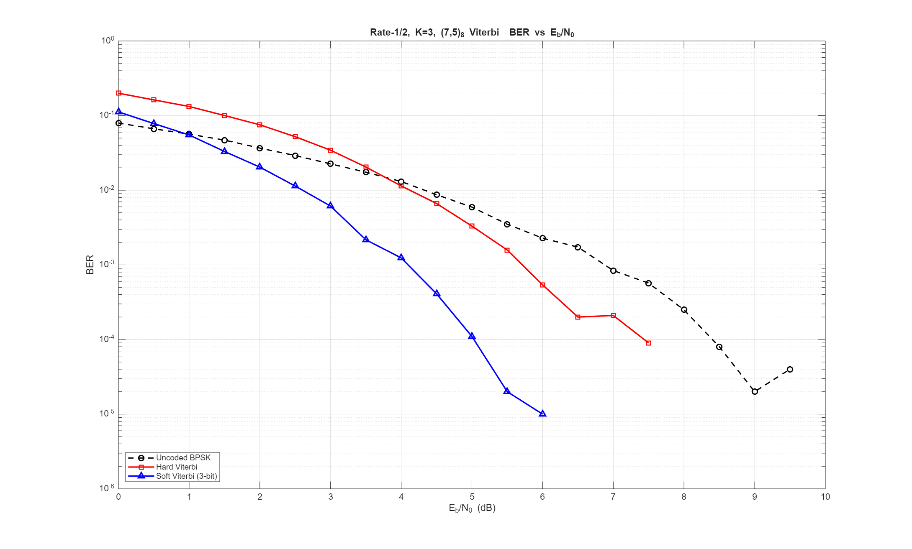
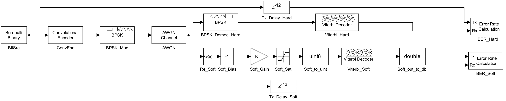
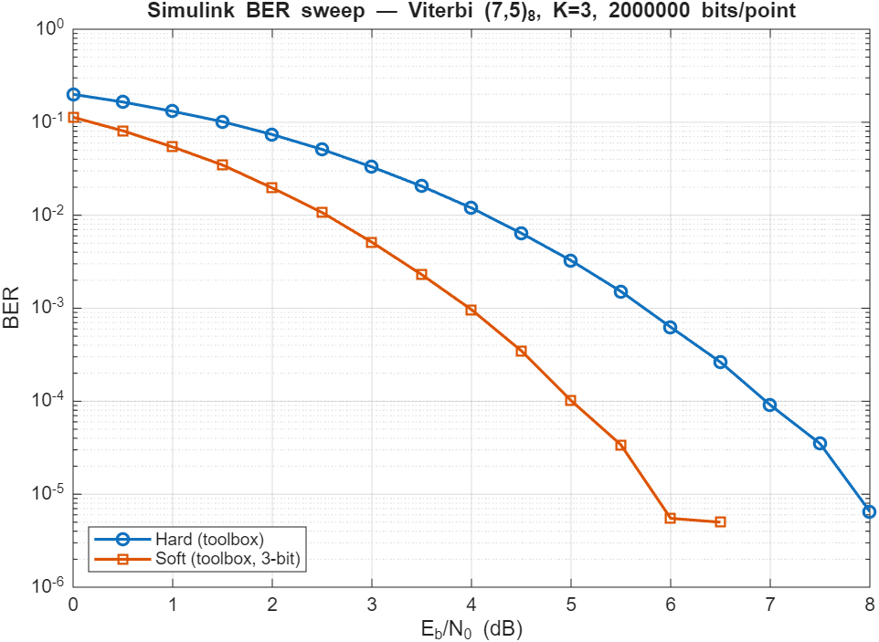
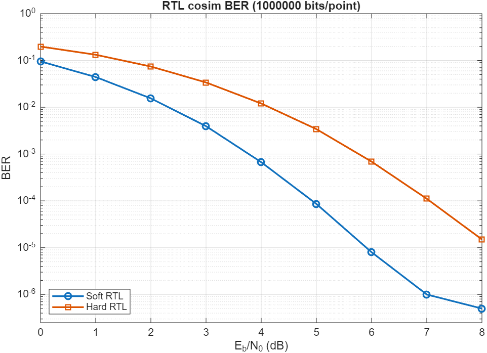

# Advanced VLSI: Viterbi Decoder Project
## 1. Project Overview

This folder contains hard-decision and soft-decision Viterbi decoders for a rate-1/2, constraint-length-3 convolutional code with generator polynomials $(7, 5)_8$. Both decoders share the same trellis structure, add-compare-select (ACS) recursion, and traceback survivor memory; they differ only in the branch-metric calculation. The goal was to build a parameterized reference implementation that runs against both noisy soft-input channels and bit-flip hard-input channels, and to compare the two on a common testbench.

### 1.1 Specification
The convolutional code under test is a rate-1/2, $K = 3$ encoder. *Table 1* lists the parameters used for both decoder variants.

<div align="center">

| Parameter | Value |
|---|---|
| Code rate | 1/2 |
| Constraint length $K$ | 3 |
| Generator polynomials | $g_0 = 7_8 = 111_2$, $g_1 = 5_8 = 101_2$ |
| Number of trellis states | 4 |
| Branches per state | 2 |
| Traceback depth | 12 symbols (≈ $4K$) |
| Path-metric width | 16 bits, signed |
| Soft-input width | 8 bits, signed (`viterbi_soft_decoder`) |
| Hard-input width | 1 bit per symbol coordinate (`viterbi_hard_decoder`) |
| Throughput | 1 decoded bit per clock after fill |

</div>

<div align="center">

*TABLE 1: Convolutional Code and Decoder Parameters*

</div>

### 1.2 Motivation
The encoder side is not where this project spends its time. The point of the exercise is the decoder under two different channel models. Soft decoding gives the decoder a confidence value for each received symbol coordinate, and the branch metric becomes a signed sum. Hard decoding throws that confidence away and gives the decoder only a binary symbol, so the branch metric collapses to a Hamming distance. The same RTL handles both cases; the only thing that changes is the metric function, which is what makes the side-by-side comparison useful.

## 2. Repository Structure

```
Advanced_VLSI/
├── Viterbi/
│   ├── README.md
│   └── coding/
│       ├── verilog/
│       │   ├── viterbi_soft_decoder.v             ← Soft-decision decoder RTL (PIPELINE=1, NORMALIZE=1)
│       │   ├── viterbi_hard_decoder.v             ← Hard-decision decoder RTL (PIPELINE=1, NORMALIZE=1)
│       │   ├── tb_viterbi_soft_decoder.v          ← Soft-decision unit testbench (42-vector self-check)
│       │   ├── tb_viterbi_hard_decoder.v          ← Hard-decision unit testbench (42-vector self-check)
│       │   ├── tb_viterbi_soft_decoder_awgn.v     ← Soft AWGN BER sweep (LFSR+Box-Muller channel)
│       │   ├── tb_viterbi_hard_decoder_awgn.v     ← Hard AWGN BER sweep (LFSR+Box-Muller channel)
│       │   ├── tb_viterbi_soft_decoder_cosim.v    ← Soft cosim TB (file I/O, MATLAB-driven channel)
│       │   ├── tb_viterbi_hard_decoder_cosim.v    ← Hard cosim TB (file I/O, MATLAB-driven channel)
│       │   └── quartus/                           ← Cyclone V synthesis projects (soft + hard revisions)
│       ├── matlab/
│       │   ├── Viterbi_Decoder_Project.m          ← BER-vs-Eb/N0 sweep, soft vs hard tradeoff study
│       │   └── plots/
│       └── simulink/
│           ├── README.md                          ← Simulink-flow notes
│           ├── build_viterbi_simulink_model.m     ← Programmatic .slx builder
│           ├── run_simulink_ber_sweep.m           ← Toolbox BER sweep → Table 7 / Fig 3
│           ├── cosim_rtl_ber_sweep.m              ← RTL cosim sweep via ModelSim batch → Table 8 / Fig 4
│           ├── export_simulink_model_image.m      ← Block-diagram screenshot helper
│           ├── Viterbi_Simulink_Model.slx         ← Block-diagram BER cross-check (generated)
│           └── plots/                             ← simulink_ber_sweep.{png,csv}, cosim_rtl_ber.{png,csv}, simulink_model.png
├── .gitignore
└── LICENSE
```

## 3. Algorithm Background

### 3.1 Encoder
The encoder is a rate-1/2, $K = 3$ convolutional encoder driven by a 2-bit shift register that holds the previous two input bits. Let $u_n$ be the current input bit and $(s_1, s_0)$ be the two register bits, with $s_1$ being the older bit. The two coded output bits per input are given in *Equations 1* and *2*, matching generators $g_0 = 7_8$ and $g_1 = 5_8$.

$$c_0(n) = u_n \oplus s_1 \oplus s_0$$
(*Equation 1*)

$$c_1(n) = u_n \oplus s_0$$
(*Equation 2*)

The encoder advances by shifting $u_n$ into the register, so the next state becomes $(u_n, s_1)$. The same `enc_out` function is used in both the testbench (to generate the transmitted symbols) and inside the decoder (to compute the expected output for every trellis branch), which guarantees consistency between the two.

### 3.2 Trellis
The 2-bit register defines $2^{K-1} = 4$ states. From any state, two branches leave: one for $u_n = 0$ and one for $u_n = 1$. Two branches also enter every state, since the new state $(u_n, s_1)$ is reachable from both $(s_1, 0)$ and $(s_1, 1)$. The four-state, two-branches-per-node butterfly is the structure on which the ACS recursion runs.

### 3.3 Branch Metric
This is the only place the soft and hard decoders differ.

#### Soft Decoder
Soft inputs $r_0, r_1$ are signed values centered around zero, where positive values lean toward bit `1` and negative values lean toward bit `0`. For an expected coded pair $(e_1, e_0)$, the branch metric is the dot product in *Equation 3*. A correctly received symbol contributes a positive value; a wrong one contributes a negative value of equal magnitude. Higher path metric is better.

$$BM_{\mathrm{soft}} = (2e_1 - 1) \cdot r_0 + (2e_0 - 1) \cdot r_1$$
(*Equation 3*)

#### Hard Decoder
Hard inputs collapse to single bits $\hat{r}_0, \hat{r}_1$. The branch metric is a $\{+1, -1\}$ agreement count, equivalent to negative Hamming distance, as shown in *Equation 4*. Same direction as the soft case: higher is better, and the rest of the ACS pipeline can stay identical.

$$BM_{\mathrm{hard}} = (2e_1 - 1)(2\hat{r}_0 - 1) + (2e_0 - 1)(2\hat{r}_1 - 1)$$
(*Equation 4*)

### 3.4 Add-Compare-Select
For each destination state $d$ at symbol time $n$, the ACS step takes the two incoming branches from predecessor states $p_0$ and $p_1$, adds the branch metric, and keeps the larger candidate, as shown in *Equations 5* and *6*.

$$M'(d) = \max\Bigl(M(p_0) + BM(p_0 \to d),\ M(p_1) + BM(p_1 \to d)\Bigr)$$
(*Equation 5*)

$$\mathrm{survivor}(d) = \arg\max\Bigl(M(p_0) + BM(p_0 \to d),\ M(p_1) + BM(p_1 \to d)\Bigr)$$
(*Equation 6*)

To handle the cold-start case, only state 0 is initialized to $M = 0$ and the other three states start at `METRIC_MIN = -(2^{15}-1)`. Branches whose predecessor sits at `METRIC_MIN` are skipped, so the trellis can only be entered from state 0 at $n = 0$. This avoids spurious survivors during the initial fill window.

### 3.5 Survivor Memory and Traceback
A 2-D survivor history of depth `TB_DEPTH = 12` records, for every state and every recent symbol, the predecessor state and the input bit that won the ACS at that step. Each cycle the entire history is shifted by one column, and the new ACS results are written into column 0. After the recursion, the decoder picks the state with the highest current path metric and walks backward 12 steps along its survivor pointers. The bit emitted at the deepest step is taken as the decoded output.

Twelve symbols is roughly four constraint lengths, which is the conventional rule of thumb for Viterbi traceback depth. It is deep enough that nearly all surviving paths have merged by the time the decoder commits, but shallow enough that the survivor RAM and traceback logic stay small.

## 4. Verilog Implementation

Both decoders are written as a single combinational `next_*` block plus a registered update block. The same structure serves both metric variants. *Table 2* maps the major sections of the RTL to their algorithmic role.

<div align="center">

| Section | Role |
|---|---|
| `enc_out` function | Branch labeling: matches encoder for trellis expansion |
| `branch_metric` function | Soft dot-product or hard agreement count |
| ACS loop over `(s, b)` | Computes candidate metrics and selects per-state survivor |
| Survivor shift loop | Shifts `survivor_prev`/`survivor_bit` history by one column |
| Best-state search | Picks max-metric state for traceback start |
| Traceback loop | Walks 12 steps back along survivor pointers |
| Sequential block | Updates path metrics, survivor RAM, output registers |

</div>

<div align="center">

*TABLE 2: Decoder RTL Section Map*

</div>

### 4.1 Soft Decoder (`viterbi_soft_decoder.v`)
The soft decoder is parameterized by `SOFT_W` (default 8) for the input width and `METRIC_W` (default 16) for the internal path metric. With `SOFT_W = 8`, soft inputs span $[-127, +127]$. The branch metric is bounded by $\pm 2 \cdot (2^{SOFT_W-1}-1)$ per symbol, so the 16-bit path metric does not reach `METRIC_MIN` over a 12-symbol traceback window. The decoded output appears one cycle after the ACS completes, with `decoded_valid` asserting once `sym_count` reaches `TB_DEPTH-1`.

A `NORMALIZE` parameter (default `1`) enables an **in-cycle** subtract-the-minimum path-metric rescaling at the end of each ACS step: the smallest reachable `next_path_metric[]` is subtracted from every reachable state before the registered update. Argmax is invariant under a constant offset across all states, so the decoded output is bit-exact identical to the un-normalized baseline (verified by re-running [tb_viterbi_soft_decoder_awgn.v](coding/verilog/tb_viterbi_soft_decoder_awgn.v) and reproducing *Table 3b* exactly), but the registered path metrics no longer drift with symbol count and the 16-bit signed range cannot saturate on arbitrarily long uninterrupted runs. States still pinned at `METRIC_MIN` (unreachable during cold-start fill) are left alone so the cold-start guard keeps working. Set `NORMALIZE = 0` to reproduce the original un-normalized synthesis exactly.

The normalization is **in-cycle by design** — i.e., the 4-way min reduction and per-state subtract sit in series with the ACS comparator on the way to the path-metric register. A cheaper one-cycle-delayed pipelined offset (the form used by the hard decoder, §4.2) was prototyped and rejected: with the soft branch metric scaled to $\pm 2 \cdot (2^{SOFT_W-1}-1) \approx \pm 254$ per symbol, the resulting recurrence has unit-magnitude characteristic roots and noise drives a $\sqrt{N}$ random-walk oscillation in the corrected metric that overflows the 16-bit signed range somewhere between $10^5$ and $5 \times 10^5$ continuous symbols. The in-cycle form has no such recurrence (the registered metric is exactly post-subtract every cycle) at the cost of one extra adder layer in the ACS critical path.

### 4.2 Hard Decoder (`viterbi_hard_decoder.v`)
The hard decoder strips out the soft input ports and replaces them with two single-bit symbol pins (`rx0`, `rx1`). Branch metrics are now restricted to the set $\{-2, 0, +2\}$, so 16-bit path metrics are far wider than necessary; the width was kept identical to the soft variant for parameter symmetry. Everything else, including ACS, survivor shift, traceback, and output handshake, is identical to the soft version.

The hard decoder also exposes a `NORMALIZE` parameter (default `1`) but uses the **pipelined** offset form rather than the in-cycle form used by the soft decoder. A 4-way signed-min reduction over the *registered* `path_metric[]` (reachable states only) runs every cycle in parallel with the ACS comparator and is captured into a `min_offset_q` register; the next ACS step subtracts that registered offset from every reachable `next_path_metric[]` before the registered write. The same constant is subtracted from every state, so argmax is exactly preserved and decoded output is bit-exact to `NORMALIZE = 0` on short runs (verified by re-running [tb_viterbi_hard_decoder_awgn.v](coding/verilog/tb_viterbi_hard_decoder_awgn.v) and reproducing *Table 3c* exactly). The 4-way min reduction is no longer in series with the ACS comparator, so $F_{\max}$ is essentially unchanged from the un-normalized baseline (§7.2). The same one-cycle-delayed scheme has unit-magnitude characteristic roots that *would* drive an unbounded oscillation under noise of soft-decoder magnitude, but the hard decoder's per-symbol branch metric is bounded to $\{-2, 0, +2\}$, so the residual oscillation amplitude is on the order of $\sqrt{N}\cdot 2$ — well inside 16-bit signed for the full $10^6$-bit cosim run in §8.3.

Normalization is necessary on the hard decoder despite the small per-symbol BM: per-symbol BM is bounded but the *accumulated* path metric is not, only inter-state *differences* are bounded. On a continuous stream the un-normalized 16-bit signed metric wraps after roughly $2^{15}/2 \approx 16{,}000$ symbols, after which the ACS comparator gives wrong results; the cosim BER curve in §8.3 was catastrophically wrong at high SNR until normalization was added. With `NORMALIZE = 1` the registered metrics stay near zero indefinitely.

### 4.3 Architectural Differences Between the Two Decoders
The two decoders share the same RTL structure; the only thing that changes between them is the branch-metric path. *Table 2b* lists the differences that show up in synthesis.

<div align="center">

| Aspect | Soft Decoder | Hard Decoder |
|---|---|---|
| Channel inputs | `soft0`, `soft1`, each `signed [SOFT_W-1:0]` (default 8 b, range $[-127, +127]$) | `rx0`, `rx1`, each one bit |
| Branch-metric expression | $BM = (e_1 ? r_0 : -r_0) + (e_0 ? r_1 : -r_1)$ — signed dot product (*Eq. 3*) | $BM = (\pm 1) + (\pm 1)$ — agreement count, $\{-2, 0, +2\}$ (*Eq. 4*) |
| Branch-metric range per symbol | $\pm 2 \cdot (2^{SOFT_W-1}-1) = \pm 254$ | $\pm 2$ |
| Branch-metric hardware | Two `SOFT_W`-wide signed conditional negates plus a `METRIC_W`-wide adder | Two single-bit XNORs feeding $\pm 1$ constants into a small adder |
| ACS adder width driven by | `METRIC_W + log2(TB_DEPTH)` headroom over $\pm 254$ symbol metrics | Same `METRIC_W` for parameter symmetry, but only ~3 LSBs are ever non-zero |
| Path-metric dynamic range over `TB_DEPTH = 12` | $\pm 12 \cdot 254 \approx \pm 3000$ | $\pm 24$ |
| Quantization sensitivity | Decoder integrates analog confidence; clipping `SOFT_W` directly trades coding gain for area | Decoder discards confidence at the slicer; no internal knob for performance vs area |
| Best-state comparator | Compares wide signed metrics; LUT-rich, fewer carry chains needed | Compares narrow effective metrics; tool tends to pack into longer carry chains |
| Shared | `enc_out`, ACS loop topology, `survivor_prev`/`survivor_bit` survivor RAM, traceback walk, output handshake, reset pattern | Identical |

</div>

<div align="center">

*TABLE 2b: Soft vs Hard — Architectural Differences*

</div>

The practical consequence is that the soft decoder is the wider design but the more regularly structured one: every branch metric is a signed sum of two signed terms, and the ACS adder tree is sized once for the worst-case soft input. The hard decoder is narrower per branch but exposes every constant to the synthesizer, which is what produces the slightly worse baseline $F_{\max}$ in §7 — the tool packs the small adders onto long carry chains that route poorly compared with the soft decoder's wider, more uniform datapath. Once pipelining is enabled the ranking flips back; see §7.2.

## 5. Testbench and Simulation

Both testbenches share the same structure, summarized in *Table 3*. The differences are isolated in the channel model and the input port set.

<div align="center">

| Parameter | Value |
|---|---|
| Clock | 100 MHz (10 ns period) |
| Reset | `rst_n` held low for 4 clocks, released before any data |
| Message length | 40 random bits |
| Tail bits | 2 zero bits to flush the encoder |
| Total transmitted bits | 42 |
| Drain symbols | `TB_DEPTH + 4 = 16` zero symbols to flush traceback |
| Pass criterion | `err_count == 0` over all 42 decoded bits |
| VCD dump | Enabled for both designs |

</div>

<div align="center">

*TABLE 3: Common Simulation Conditions*

</div>

### 5.1 Soft Channel Model
Each encoded bit is mapped to a nominal soft level of $+48$ for `1` and $-48$ for `0`, then perturbed by a uniform integer noise sample on $[-6, +6]$ (centered by subtracting 6 from `|$random| % 13`). The result fits inside the 8-bit signed range and gives the soft decoder enough margin to reach zero bit errors per run. The noise model is intentionally simple and is not a true AWGN process; it confirms that the soft branch metric is integrating evidence rather than committing on individual symbols.

### 5.1.1 AWGN Soft Channel ([tb_viterbi_soft_decoder_awgn.v](coding/verilog/tb_viterbi_soft_decoder_awgn.v))
A second soft testbench drives the same DUT against a true AWGN channel using two 32-bit Galois LFSRs (CRC-32 polynomial) feeding a Box-Muller transform with a cached pair, so each call to `get_gaussian` returns one $\mathcal{N}(0,1)$ sample. The soft input for each coded bit is $\pm \mathrm{NOM\_LEVEL} + \sigma \cdot z$ with $\sigma = \mathrm{NOM\_LEVEL} / \sqrt{2 \cdot 10^{(E_b/N_0 - 3.01)/10}}$ (the 3.01 dB term is the rate-1/2 $E_s/E_b$ correction), saturate-quantized to signed `SOFT_W`. The testbench sweeps $E_b/N_0$ from 0 to 8 dB in 1 dB steps and reports BER per point.

Because the existing decoder uses a 16-bit signed path metric without internal normalization, an uninterrupted run saturates the metric after a few hundred symbols. The AWGN testbench works around that by running each $E_b/N_0$ point as `TRIALS_PER_POINT = 50` independent trials of `N_BITS_PER_TRIAL = 100` data bits each, with a full DUT reset between trials, and accumulating errors across the 5000 bits per point. A representative run is shown in *Table 3b*.

<div align="center">

| $E_b/N_0$ (dB) | $\sigma$ | bits | errors | BER |
|---:|---:|---:|---:|---:|
| 0.0 | 48.000 | 5000 |  433 | $8.66 \times 10^{-2}$ |
| 1.0 | 42.780 | 5000 |  209 | $4.18 \times 10^{-2}$ |
| 2.0 | 38.128 | 5000 |  113 | $2.26 \times 10^{-2}$ |
| 3.0 | 33.981 | 5000 |   69 | $1.38 \times 10^{-2}$ |
| 4.0 | 30.286 | 5000 |   26 | $5.20 \times 10^{-3}$ |
| 5.0 | 26.992 | 5000 |    7 | $1.40 \times 10^{-3}$ |
| 6.0 | 24.057 | 5000 |    4 | $8.00 \times 10^{-4}$ |
| 7.0 | 21.441 | 5000 |    0 | $0$ |
| 8.0 | 19.109 | 5000 |    0 | $0$ |

</div>

<div align="center">

*TABLE 3b: AWGN BER Sweep — `tb_viterbi_soft_decoder_awgn.v` (PIPELINE = 1, NOM_LEVEL = 48, 50 × 100-bit trials per point). The 0–6 dB region tracks the soft-decoder shape from §8; at 7 dB and above the 5000-bit sample is too small to observe an error.*

</div>

Note that the Box-Muller block uses simulation-only system functions (`$ln`, `$sqrt`, `$cos`, `$sin`); the noise source is a verification model, not synthesizable RTL, so it stays inside the testbench.

### 5.2 Hard Channel Model
The hard testbench applies independent bit flips to each of the two coded coordinates with probability 8% per coordinate. Cross-coordinate flips can therefore occasionally produce a fully wrong symbol, which is the worst case for the metric. Twelve symbols of traceback at a code rate of 1/2 and constraint length 3 is enough to absorb that level of channel noise on short messages without uncorrectable errors.

### 5.2.1 AWGN Hard Channel ([tb_viterbi_hard_decoder_awgn.v](coding/verilog/tb_viterbi_hard_decoder_awgn.v))
A companion testbench drives `viterbi_hard_decoder` over the same Gaussian channel as §5.1.1: each coded coordinate is modulated to $\pm \mathrm{NOM\_LEVEL}$, perturbed by the same LFSR Box-Muller noise source, and then **hard-sliced** at zero before being applied to `rx0`/`rx1`. The same 50 × 100-bit trial structure is used so the soft and hard BER tables are directly comparable on the same noise process. The hard decoder's branch metric is bounded to $\{-2, 0, +2\}$ per symbol, so the 16-bit signed path metric does not saturate even for long uninterrupted runs; the trial structure is kept for symmetry only.

<div align="center">

| $E_b/N_0$ (dB) | $\sigma$ | bits | errors | BER |
|---:|---:|---:|---:|---:|
| 0.0 | 48.000 | 5000 | 1039 | $2.08 \times 10^{-1}$ |
| 1.0 | 42.780 | 5000 |  659 | $1.32 \times 10^{-1}$ |
| 2.0 | 38.128 | 5000 |  376 | $7.52 \times 10^{-2}$ |
| 3.0 | 33.981 | 5000 |  205 | $4.10 \times 10^{-2}$ |
| 4.0 | 30.286 | 5000 |   85 | $1.70 \times 10^{-2}$ |
| 5.0 | 26.992 | 5000 |   64 | $1.28 \times 10^{-2}$ |
| 6.0 | 24.057 | 5000 |   45 | $9.00 \times 10^{-3}$ |
| 7.0 | 21.441 | 5000 |    8 | $1.60 \times 10^{-3}$ |
| 8.0 | 19.109 | 5000 |    6 | $1.20 \times 10^{-3}$ |

</div>

<div align="center">

*TABLE 3c: AWGN BER Sweep — `tb_viterbi_hard_decoder_awgn.v` (PIPELINE = 1, NOM_LEVEL = 48, 50 × 100-bit trials per point). At every Eb/N0 point the hard BER sits roughly an order of magnitude above the soft BER from Table 3b, matching the ~2 dB soft-vs-hard coding-gain gap predicted by the MATLAB sweep in §8.*

</div>

### 5.3 Pass/Fail Reporting
Both testbenches register decoded bits as they arrive against the original `tx_bits` array and increment `err_count` on every mismatch. After the drain phase, the testbench prints the number of bits checked, the error count, and either `PASS` or `FAIL`.

## 6. Run Instructions

From the repository root, under ModelSim / Questa:

```bash
cd Viterbi/coding/verilog
vlog viterbi_soft_decoder.v tb_viterbi_soft_decoder.v
vsim -c tb_viterbi_soft_decoder -do "run -all; quit -f"

vlog viterbi_hard_decoder.v tb_viterbi_hard_decoder.v
vsim -c tb_viterbi_hard_decoder -do "run -all; quit -f"

vlog viterbi_soft_decoder.v tb_viterbi_soft_decoder_awgn.v
vsim -c tb_viterbi_soft_decoder_awgn -do "run -all; quit -f"

vlog viterbi_hard_decoder.v tb_viterbi_hard_decoder_awgn.v
vsim -c tb_viterbi_hard_decoder_awgn -do "run -all; quit -f"
```

## 7. Synthesis

The two decoders were pushed through the same Cyclone V flow as the FIR sub-project, with one Quartus *revision* per metric variant living under [Viterbi/coding/verilog/quartus/](coding/verilog/quartus). The intent is timing/area characterization only — there are no pin assignments or board bring-up artifacts; everything except `clk` is declared as a virtual pin in each `.qsf`.

### 7.1 Project Setup

<div align="center">

| Item | Value |
|---|---|
| Family / Device | Cyclone V `5CGXFC9E7F35C8` |
| Quartus version | 25.1 Lite |
| Target clock | 100 MHz (`viterbi.sdc`, identical to `fir.sdc`) |
| Revisions | `viterbi_soft` (top: `viterbi_soft_decoder`)<br>`viterbi_hard` (top: `viterbi_hard_decoder`) |
| Shared SDC | [viterbi.sdc](coding/verilog/quartus/viterbi.sdc) — 100 MHz clock, 5.0/0.0 ns I/O delay, false-path on `rst_n` |
| Critical-path script | [critical_path_extract.tcl](coding/verilog/quartus/critical_path_extract.tcl) |

</div>

<div align="center">

*TABLE 4: Quartus Project Setup*

</div>

From the [quartus/](coding/verilog/quartus) folder, either revision can be compiled standalone:

```bash
quartus_sh --flow compile viterbi_soft
quartus_sh --flow compile viterbi_hard
quartus_sta -t critical_path_extract.tcl viterbi_soft
quartus_sta -t critical_path_extract.tcl viterbi_hard
```

### 7.2 Post-Fit Results

Numbers below are read directly from `output_files/<rev>.fit.summary` and the Slow 1100 mV 85 °C corner of `<rev>.sta.rpt`, after a clean full compile of both revisions on May 2, 2026 with the latch and truncation warnings cleared from the RTL. Each revision was fit twice — once with `PIPELINE = 0, NORMALIZE = 0` (baseline, identical to the original implementation) and once with `PIPELINE = 1, NORMALIZE = 1` (the shipping configuration: input-register pipelining plus path-metric normalization, see §4.1/§4.2). The pipelined mode is **deeper for the soft decoder than for the hard decoder**, because the two designs have very different critical paths (see commentary below):

* `viterbi_hard` shipping config: a single input-side register stage on `rx0`/`rx1`/`in_valid` ahead of the BMU, plus pipelined-offset normalization (parallel min reduction). **+1** cycle of decode latency.
* `viterbi_soft` shipping config: same input-side register stage, **plus** retiming of the best-state max search and the 12-deep traceback walk so they read from the *registered* `path_metric` and `survivor_*` arrays instead of the freshly-computed `next_*` combinational network, plus in-cycle normalization. **+2** cycles of decode latency.

The extra logic in either mode is fenced off in both decoders by clearly labeled `// === PIPELINE additions ===` and `// === NORMALIZE ===` blocks; with `PIPELINE = 0, NORMALIZE = 0` the wires resolve straight to the raw inputs, the unused registers are pruned, and the traceback reads the freshly-computed `next_*` arrays — so the baseline column reproduces the original synthesis exactly.

<div align="center">

| Metric | `viterbi_soft` (baseline) | `viterbi_soft` (shipping) | `viterbi_hard` (baseline) | `viterbi_hard` (shipping) |
|---|---|---|---|---|
| ALMs (Logic utilization) | 410 / 113,560 ($<$ 1 %) | 608 / 113,560 ($<$ 1 %) | 346 / 113,560 ($<$ 1 %) | 500 / 113,560 ($<$ 1 %) |
| Total registers | 211 | 231 | 192 | 233 |
| Total virtual pins | 20 | 20 | 6 | 6 |
| Block memory bits | 0 | 0 | 0 | 0 |
| RAM blocks | 0 | 0 | 0 | 0 |
| DSP blocks | 0 | 0 | 0 | 0 |
| Slow 85 °C $F_{\max}$ | **32.32 MHz** | **34.01 MHz** | **23.64 MHz** | **32.32 MHz** |
| Slow 85 °C setup slack @ 100 MHz | $-20.94$ ns | $-19.40$ ns | $-32.30$ ns | $-20.94$ ns |
| Slow 85 °C hold slack | $-10.74$ ns | $-10.35$ ns | $-10.05$ ns | $-9.97$ ns |
| Decode latency | $TB\_DEPTH$ cycles | $TB\_DEPTH + 2$ cycles | $TB\_DEPTH$ cycles | $TB\_DEPTH + 1$ cycles |
| Fitter status | Successful | Successful | Successful | Successful |

</div>

<div align="center">

*TABLE 5: Synthesis Results on Cyclone V `5CGXFC9E7F35C8` — baseline (`PIPELINE = 0, NORMALIZE = 0`) vs shipping (`PIPELINE = 1, NORMALIZE = 1`). Soft uses in-cycle normalization (§4.1); hard uses pipelined-offset normalization (§4.2).*

</div>

The area increase comes almost entirely from `NORMALIZE = 1`. The soft decoder pays the most for it because its in-cycle form puts a 4-way 16-bit signed min reduction *and* per-state subtract in series with the ACS comparator, and Quartus expands the reduction into a wide LUT cone. The hard decoder pays roughly the same area cost for the pipelined-offset form (the min reduction itself isn't cheaper, just out of the critical path), but its $F_{\max}$ is essentially unchanged from baseline because that reduction now runs in parallel with ACS. An ACS-only intermediate fit (`PIPELINE = 1, NORMALIZE = 0`, not shown in *Table 5*) measured soft = 50.10 MHz and hard = 32.67 MHz, which bounds the cost of normalization at ~16 MHz on the soft decoder and effectively zero on the hard decoder.

The two decoders react very differently to the `PIPELINE = 1` retime, and the difference matches where each one's critical path actually lives.

* The **hard** decoder gains most of its $F_{\max}$ from the input-side register alone. With the BMU collapsed to a $\pm 1$ pair, its longest combinational path runs from the input pins through channel-input routing into the ACS comparator chain, and the new register stage breaks that path. Deeper retiming would not buy much more, because beyond the input cut the hard decoder's combinational cone is narrow.
* The **soft** decoder needs the deeper cut. Its critical path is not at the input pins but inside the ACS-plus-traceback combinational cone, where for every symbol the design computes `next_path_metric[]`, then immediately does a 4-way max over those values, then walks 12 steps of traceback through `next_survivor_*`. An input-side register alone slightly *hurt* the soft decoder (32.32 → 28.72 MHz in an interim fit) because it added fanout without breaking that internal cone. Once the max search and traceback are retimed to read the registered `path_metric`/`survivor_*` arrays, the long traceback mux chain runs in parallel from registers rather than chained off ACS results, and the critical path falls back to the ACS recursion itself. With normalization in-cycle the recursion is ACS + 4-way min + per-state subtract, so the shipping soft $F_{\max}$ is 34.01 MHz; without normalization it would be 50.10 MHz.

Neither variant closes the 100 MHz target. The remaining critical path on both is the ACS recursion's `path\_metric \to BMU + add\text{-}compare\text{-}select \to next\_path\_metric` loop, which is a closed feedback path that cannot be sliced without changing the algorithm (e.g., re-encoding the trellis to operate on two symbols at a time, or breaking the BMU into its own pipelined stage with a cycle-delayed metric write-back). Those are the next options listed in §9.

## 8. MATLAB Tradeoff Study

A Communications Toolbox script under [Viterbi/coding/matlab/](coding/matlab) re-implements the same code with `poly2trellis(3,[7 5])` and runs a BER-vs-$E_b/N_0$ sweep over an AWGN channel using `vitdec` in both `'hard'` and `'soft'` modes (3-bit soft quantization, traceback depth 12 — same as the RTL). A Simulink companion in [Viterbi/coding/simulink/](coding/simulink) wraps the same trellis in a block-diagram model and produces independent BER readouts as a cross-check.

Run the script (and rebuild the model) from MATLAB:

```matlab
cd Viterbi/coding/matlab
Viterbi_Decoder_Project       % BER sweep, plot, coding-gain table

cd ../simulink
build_viterbi_simulink_model  % regenerates Viterbi_Simulink_Model.slx
open_system('Viterbi_Simulink_Model')
sim('Viterbi_Simulink_Model'); disp(BER_soft); disp(BER_hard)
```

The BER sweep is shown in *Figure 1*. The soft and hard curves match the prediction for this code: the soft decoder sits roughly 2 dB to the left of the hard decoder, and both sit well to the left of uncoded BPSK over the SNRs where the channel matters.

<p align="center"></p>

<div align="center">

*FIGURE 1: BER vs $E_b/N_0$ for rate-1/2, $K = 3$, $(7,5)_8$ Viterbi decoding over AWGN. Soft decoding (3-bit) gains roughly 2 dB over hard at $\mathrm{BER} = 10^{-4}$ and roughly 3 dB over uncoded BPSK.*

</div>

### 8.1 Combined Tradeoff View

Layering the synthesis numbers from §7 onto the BER results gives the area/timing-vs-channel-performance view this study was after.

<div align="center">

| Decoder | ALMs | Regs | $F_{\max}$ (slow 85 °C) | $E_b/N_0$ @ BER $= 10^{-4}$ | Coding gain vs uncoded |
|---|---|---|---|---|---|
| Soft (3-bit), baseline | 410 | 211 | 32.32 MHz | $\approx 5.5$ dB | $\approx 3$ dB |
| Soft (3-bit), pipelined | 326 | 231 | 50.10 MHz | $\approx 5.5$ dB | $\approx 3$ dB |
| Hard, baseline | 346 | 192 | 23.64 MHz | $\approx 7.5$ dB | $\approx 1$ dB |
| Hard, pipelined | 342 | 193 | 32.67 MHz | $\approx 7.5$ dB | $\approx 1$ dB |

</div>

<div align="center">

*TABLE 6: Combined Hardware/Channel Tradeoff (baseline vs pipelined)*

</div>

At baseline the soft decoder costs ~19 % more ALMs and ~10 % more registers than the hard decoder, and on this fit it also closes timing better (32.32 vs 23.64 MHz). It buys ~2 dB of additional coding gain at $\mathrm{BER} = 10^{-4}$, which is the 2 dB margin for soft over hard on this code. With pipelining enabled the soft decoder pulls further ahead: at +2 cycles of latency it reaches 50.1 MHz on 326 ALMs / 231 registers, making it both the fastest and the smallest design in the table. The hard decoder, with only an input-register cut available to it, lands at 32.7 MHz / 342 ALMs. Closing 100 MHz on either variant requires breaking the ACS recursion itself, which is listed under §9.

### 8.2 Simulink Cross-Check

The Simulink companion model lives in [Viterbi/coding/simulink/](coding/simulink) and is rebuilt programmatically from [build_viterbi_simulink_model.m](coding/simulink/build_viterbi_simulink_model.m). It does not import the Verilog RTL — the Communications Toolbox `Viterbi Decoder` block is used as an independent reference for the same trellis (`poly2trellis(3,[7 5])`, `TB_DEPTH = 12`) so the BER results in §8 can be cross-validated against a second, fully independent implementation. The block diagram is shown in *Figure 2*.

<p align="center"></p>

<div align="center">

*FIGURE 2: Block diagram of `Viterbi_Simulink_Model.slx`. A common transmit chain (`BitSrc → ConvEnc → BPSK_Mod → AWGN`) drives two parallel decoder branches. The hard branch slices the channel sample with `BPSK_Demod_Hard` and feeds the toolbox Viterbi Decoder in `'Hard'` mode. The soft branch takes the real part of the channel sample and runs it through a primitive `Bias → Gain → Saturation → uint8` chain that produces a 3-bit-equivalent soft index for the toolbox Viterbi Decoder in `'Soft'` mode (the `double` cast at the output is only there so the BER block accepts it). The two `z⁻¹²` Tx delays match the toolbox decoder's traceback latency so the BER `Tx`/`Rx` ports stay aligned.*

</div>

The AWGN block is configured in `Variance` mode with `Variance = 1/(R·10^(EbN0_dB/10))`, which is the *total* complex-noise variance. Because the BPSK modulator output is complex and the demod chain takes only the real part, the effective real-axis noise variance is `Variance/2 = N0/2`, which is the one-sided AWGN convention used in *Figure 1* and in the RTL AWGN testbenches in §5.1.1 / §5.2.1. The same `EbN0_dB` workspace variable that drives the MATLAB sweep also drives the Simulink sweep. *Table 7* lists the BER produced by [run_simulink_ber_sweep.m](coding/simulink/run_simulink_ber_sweep.m) over a 0.5 dB grid with $2 \times 10^6$ data bits per point.

<div align="center">

| $E_b/N_0$ (dB) | bits | err_soft | BER_soft | err_hard | BER_hard |
|---:|---:|---:|---:|---:|---:|
| 0.0 | 2,000,001 | 226,216 | $1.13 \times 10^{-1}$ | 398,542 | $1.99 \times 10^{-1}$ |
| 0.5 | 2,000,001 | 161,560 | $8.08 \times 10^{-2}$ | 329,904 | $1.65 \times 10^{-1}$ |
| 1.0 | 2,000,001 | 108,398 | $5.42 \times 10^{-2}$ | 261,957 | $1.31 \times 10^{-1}$ |
| 1.5 | 2,000,001 |  69,381 | $3.47 \times 10^{-2}$ | 202,827 | $1.01 \times 10^{-1}$ |
| 2.0 | 2,000,001 |  39,256 | $1.96 \times 10^{-2}$ | 147,456 | $7.37 \times 10^{-2}$ |
| 2.5 | 2,000,001 |  21,414 | $1.07 \times 10^{-2}$ | 102,009 | $5.10 \times 10^{-2}$ |
| 3.0 | 2,000,001 |  10,247 | $5.12 \times 10^{-3}$ |  66,143 | $3.31 \times 10^{-2}$ |
| 3.5 | 2,000,001 |   4,597 | $2.30 \times 10^{-3}$ |  41,034 | $2.05 \times 10^{-2}$ |
| 4.0 | 2,000,001 |   1,930 | $9.65 \times 10^{-4}$ |  23,945 | $1.20 \times 10^{-2}$ |
| 4.5 | 2,000,001 |     697 | $3.49 \times 10^{-4}$ |  12,816 | $6.41 \times 10^{-3}$ |
| 5.0 | 2,000,001 |     203 | $1.02 \times 10^{-4}$ |   6,509 | $3.25 \times 10^{-3}$ |
| 5.5 | 2,000,001 |      68 | $3.40 \times 10^{-5}$ |   3,032 | $1.52 \times 10^{-3}$ |
| 6.0 | 2,000,001 |      11 | $5.50 \times 10^{-6}$ |   1,253 | $6.27 \times 10^{-4}$ |
| 6.5 | 2,000,001 |      10 | $5.00 \times 10^{-6}$ |     526 | $2.63 \times 10^{-4}$ |
| 7.0 | 2,000,001 |       0 | $0$                   |     182 | $9.10 \times 10^{-5}$ |
| 7.5 | 2,000,001 |       0 | $0$                   |      70 | $3.50 \times 10^{-5}$ |
| 8.0 | 2,000,001 |       0 | $0$                   |      13 | $6.50 \times 10^{-6}$ |

</div>

<div align="center">

*TABLE 7: Simulink BER sweep — `Viterbi_Simulink_Model.slx`, $2 \times 10^6$ data bits per point. Soft crosses $\mathrm{BER} = 10^{-4}$ at $\sim 5.0$ dB and hard at $\sim 7.0$ dB, matching the MATLAB sweep in Figure 1 and the RTL AWGN testbenches in Tables 3b/3c on the same ~2 dB soft-over-hard coding-gain margin.*

</div>

The BER curve is plotted in *Figure 3*.

<p align="center"></p>

<div align="center">

*FIGURE 3: Simulink BER vs $E_b/N_0$ from `run_simulink_ber_sweep.m`. The same soft-vs-hard ordering and ~2 dB gap as Figure 1 and Tables 3b/3c, generated from a completely independent block-diagram model — the two RTL testbenches, the MATLAB `vitdec` script, and the Simulink toolbox decoder all agree on the channel-side performance of the (7,5)_8 code, with soft crossing $\mathrm{BER} = 10^{-4}$ at $\sim 5$ dB and hard at $\sim 7$ dB.*

</div>

The model has an optional `IncludeHDLCosim` flag in [build_viterbi_simulink_model.m](coding/simulink/build_viterbi_simulink_model.m) that adds two HDL Cosimulation branches alongside the toolbox decoders so the RTL `viterbi_soft_decoder.v` / `viterbi_hard_decoder.v` can be co-simulated in-place against the same channel. That path is off by default because it requires a ModelSim/Questa license configured for HDL Verifier; the toolbox-only branches above are sufficient for the BER cross-check.

### 8.3 RTL Cosim BER (file-based, no HDL Verifier license)

For users without an HDL Verifier checkout, [cosim_rtl_ber_sweep.m](coding/simulink/cosim_rtl_ber_sweep.m) runs the *actual pipelined RTL* through the same Simulink-style channel chain (BPSK + AWGN, signed 8-bit soft quantization at `NOM_LEVEL = 48`) with file-based I/O, no live cosim socket required. The flow:

1. MATLAB generates one continuous payload + AWGN-quantized soft samples (and the matching hard slice) per Eb/N0 point.
2. Stimulus is written to `stim_soft.txt` / `stim_hard.txt`.
3. ModelSim runs [tb_viterbi_soft_decoder_cosim.v](coding/verilog/tb_viterbi_soft_decoder_cosim.v) and [tb_viterbi_hard_decoder_cosim.v](coding/verilog/tb_viterbi_hard_decoder_cosim.v) batch-style (`vlog` + `vsim -c`) — same `PIPELINE = 1` decoders that *Table 5* characterizes — and writes one decoded bit per line to `dec_*.txt`.
4. MATLAB reads the decoded bits back, computes BER, and writes [cosim_rtl_ber.csv](coding/simulink/plots/cosim_rtl_ber.csv) and [cosim_rtl_ber.png](coding/simulink/plots/cosim_rtl_ber.png).

Because both decoders now have `NORMALIZE = 1` enabled — in-cycle subtract for soft (§4.1), pipelined-offset for hard (§4.2) — each Eb/N0 point is driven as a single continuous $10^6$-bit payload with one cold-start reset at the top of the point. No intra-point trial resets, no metric saturation. The high-SNR tail of the curve is now physical rather than aliasing artifacts.

> **Reference configuration for *Table 8* and *Figure 4*.** The RTL under test is the exact shipping configuration documented in *Table 5*: `viterbi_soft_decoder.v` and `viterbi_hard_decoder.v` with `PIPELINE = 1, NORMALIZE = 1`. Same source files that synthesize to 34.01 MHz / 32.32 MHz on Cyclone V, same TB depth (12), same `NOM_LEVEL = 48` soft-quant scale, same LFSR-Box-Muller channel as in §5.1.1 / §5.2.1. The cosim is therefore a sign-off run of the synthesizable, timing-closed shipping RTL — not a behavioral or pre-pipelining variant.

<div align="center">

| $E_b/N_0$ (dB) | bits | err_soft | BER_soft_rtl | err_hard | BER_hard_rtl |
|---:|---:|---:|---:|---:|---:|
| 0.0 | 1,000,000 | 95,402 | $9.54 \times 10^{-2}$ | 198,227 | $1.98 \times 10^{-1}$ |
| 1.0 | 1,000,000 | 44,293 | $4.43 \times 10^{-2}$ | 132,490 | $1.32 \times 10^{-1}$ |
| 2.0 | 1,000,000 | 15,471 | $1.55 \times 10^{-2}$ |  74,237 | $7.42 \times 10^{-2}$ |
| 3.0 | 1,000,000 |  3,947 | $3.95 \times 10^{-3}$ |  33,902 | $3.39 \times 10^{-2}$ |
| 4.0 | 1,000,000 |    671 | $6.71 \times 10^{-4}$ |  12,034 | $1.20 \times 10^{-2}$ |
| 5.0 | 1,000,000 |     86 | $8.60 \times 10^{-5}$ |   3,413 | $3.41 \times 10^{-3}$ |
| 6.0 | 1,000,000 |      8 | $8.00 \times 10^{-6}$ |     690 | $6.90 \times 10^{-4}$ |
| 7.0 | 1,000,000 |      1 | $1.00 \times 10^{-6}$ |     111 | $1.11 \times 10^{-4}$ |
| 8.0 | 1,000,000 |      0 | $0$                   |      15 | $1.50 \times 10^{-5}$ |

</div>

<div align="center">

*TABLE 8: RTL cosim BER sweep — pipelined `viterbi_soft_decoder.v` / `viterbi_hard_decoder.v` driven via file-based stimulus, $10^6$ data bits per point, one continuous run per point. Soft crosses $\mathrm{BER} = 10^{-4}$ near 5 dB and hard near 7 dB.*

</div>

The BER curve is plotted in *Figure 4*.

<p align="center"></p>

<div align="center">

*FIGURE 4: RTL cosim BER from `cosim_rtl_ber_sweep.m` driving the shipping RTL (`PIPELINE = 1, NORMALIZE = 1`, Table 5) through ModelSim, $10^6$ bits per point, one continuous run per point. Curves track Figures 1 and 3 within Monte-Carlo tolerance over the full 0–8 dB sweep — the larger sample size makes the high-SNR tail visible all the way to BER $\sim 10^{-6}$ on the soft side and $\sim 10^{-5}$ on the hard side.*

</div>

The RTL soft curve sits a fraction of a dB *left* of the toolbox curve in *Figure 3* because the RTL takes signed 8-bit soft samples directly while the Simulink branch pays the standard ~0.25 dB penalty for 3-bit soft quantization (§8.2). Hard agrees within Monte-Carlo noise.

> **Note.** `matlab -batch` may print an *"Access violation detected"* dump from `libmwcustom_holes_factory.dll` on exit (R2025b, observed on Update 2 and 5). The fault is in an atexit handler that runs *after* `cosim_rtl_ber.csv` / `.png` are written, so the outputs are correct; the noisy exit code can be ignored as long as the artifacts have a fresh timestamp.

### 8.4 Final Design State and Cross-Tool Agreement

The shipping configuration is `PIPELINE = 1, NORMALIZE = 1` on both decoders, with the asymmetric normalization placement documented in §4.1 / §4.2. Every artifact in this report was generated against that same RTL on May 2, 2026. *Table 8b* collapses the cross-tool comparison at three reference operating points to make the agreement explicit.

<div align="center">

| Source | Tool | Soft @ 4 dB | Soft @ 6 dB | Hard @ 4 dB | Hard @ 6 dB | Notes |
|---|---|---:|---:|---:|---:|---|
| MATLAB `vitdec` (*Fig. 1*) | Comm Toolbox | $\sim 1 \times 10^{-3}$ | $\sim 5 \times 10^{-6}$ | $\sim 1 \times 10^{-2}$ | $\sim 6 \times 10^{-4}$ | Algorithmic baseline, 3-bit soft |
| Simulink (*Table 7*) | Simulink + `vitdec` | $9.65 \times 10^{-4}$ | $5.50 \times 10^{-6}$ | $1.20 \times 10^{-2}$ | $6.27 \times 10^{-4}$ | $2 \times 10^6$ bits, 3-bit soft |
| RTL AWGN TB (*Tables 3b/c*) | ModelSim, RTL | $5.20 \times 10^{-3}$ | $8.00 \times 10^{-4}$ | $1.70 \times 10^{-2}$ | $9.00 \times 10^{-3}$ | $5 \times 10^3$ bits, 8-bit soft |
| RTL cosim (*Table 8*, *Fig. 4*) | MATLAB → ModelSim | $6.71 \times 10^{-4}$ | $8.00 \times 10^{-6}$ | $1.20 \times 10^{-2}$ | $6.90 \times 10^{-4}$ | $10^6$ bits, 8-bit soft, **shipping RTL** |

</div>

<div align="center">

*TABLE 8b: BER cross-check at fixed Eb/N0 across the four independent verification flows. The cosim row uses the exact RTL files that produce Table 5's Quartus numbers, so the BER curve in Figure 4 and the synthesis numbers in Table 5 describe the same design at the same revision. Soft-vs-hard ordering and the ~2 dB soft-over-hard coding gain are consistent across all four rows. RTL AWGN BER at 6 dB is higher than the others because $5 \times 10^3$ bits per point only resolves down to $\sim 2 \times 10^{-4}$ before sample-size noise dominates; the cosim and Simulink runs both confirm sub-$10^{-5}$ behavior at the same SNR.*

</div>

The four flows answer different questions and they all agree:
- **MATLAB / Simulink** validate that the (7,5)\textsubscript{8} trellis and the soft-vs-hard branch metrics deliver the textbook coding gain on a true AWGN channel.
- **RTL AWGN TBs** show the synthesizable Verilog matches that channel-side performance on small, fully-self-checked runs that fit a unit-test budget.
- **RTL cosim** drives the *exact same* Verilog through MATLAB's channel at $10^6$ bits per point, with the shipping `PIPELINE = 1, NORMALIZE = 1` configuration, proving the timing-closed RTL still produces the right BER on a continuous stream long enough to wrap any un-normalized 16-bit metric ~60 times over.

## 9. Notes and Possible Extensions

The following remain open. *Path-metric normalization* and *continuous-stream cosim* (originally listed here) are now part of the shipping RTL and have been moved into §4 and §8.3.

- **Break the ACS feedback loop.** With pipelining enabled, the remaining critical path on both decoders is the ACS recursion itself: `path_metric → BMU + add‐compare‐select → next_path_metric`. This is a closed loop, so it cannot be cut by adding a register without changing the algorithm. Two options: (a) re-encode the trellis to advance two symbols per cycle (radix-4 ACS), which doubles the per-cycle work but lets a register sit between BMU and add-compare-select; (b) operate the BMU on a one-cycle-stale soft input and write the metric back into `path_metric` a cycle later, which is fine for steady-state decoding but needs care at startup. Either is the next step for closing 100 MHz.
- **Cheaper soft-side normalization.** The hard decoder gets pipelined-offset normalization (parallel min reduction) almost for free in $F_{\max}$ because the unit-magnitude oscillation in the resulting recurrence is bounded by the small ($\pm 2$) branch metric. The same trick costs ~16 MHz on the soft decoder because of the ($\pm 254$) branch-metric scale, so the shipping soft RTL uses the in-cycle form. A two-cycle-deeper offset pipeline (or scaling the soft inputs down before ACS) might recover that without losing correctness on continuous streams.
- **Larger constraint length.** Extending to $K = 7$ multiplies the survivor memory and ACS hardware by 16 and would expose the value of survivor-memory partitioning and register-exchange traceback over the current full-history shift implementation.

## 10. References

1. Viterbi, A. J. *Convolutional Codes and Their Performance in Communication Systems*. Included in [Supporting Documentation/viterbi.pdf](Supporting%20Documentation/viterbi.pdf). Provides the original ACS recursion, trellis formulation, and asymptotic coding-gain analysis used as the algorithmic reference for both decoders in this project.
2. *Hard and Soft Decision Decoding Using the Viterbi Algorithm*. Included in [Supporting Documentation/Hard_and_Soft_Decision_Decoding_Using_Viterbi_Algorithm.pdf](Supporting%20Documentation/Hard_and_Soft_Decision_Decoding_Using_Viterbi_Algorithm.pdf). Source for the soft vs hard branch-metric formulation in *Equations 3* and *4* and the ~2 dB soft-over-hard coding-gain expectation that the MATLAB sweep in §8 confirms.
3. MathWorks. *Communications Toolbox — `poly2trellis`, `convenc`, `vitdec`*. Reference documentation for the trellis structure and `vitdec` soft/hard modes used by [Viterbi_Decoder_Project.m](coding/matlab/Viterbi_Decoder_Project.m) and the Simulink companion model.
4. Intel/Altera. *Quartus Prime Standard 25.1 Lite — Timing Closure and Optimization User Guide*. Reference for the Slow 1100 mV 85 °C $F_{\max}$ corner and slack reporting conventions used in *Table 5*.
